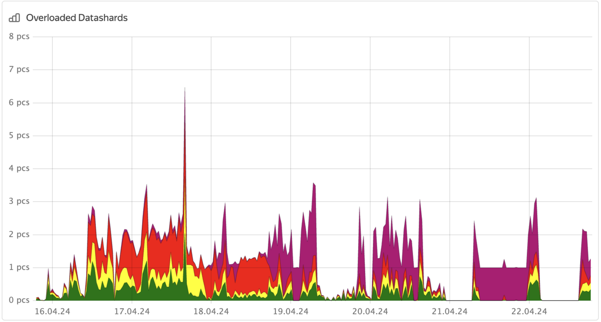
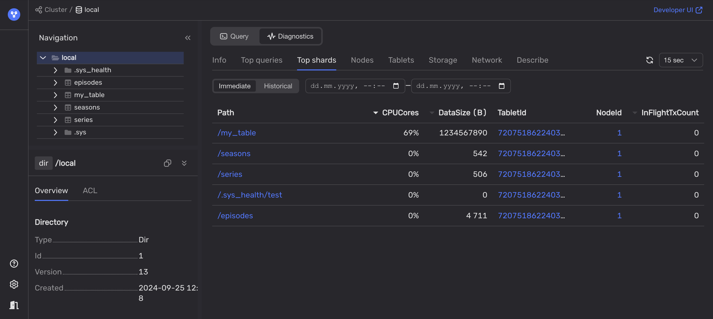
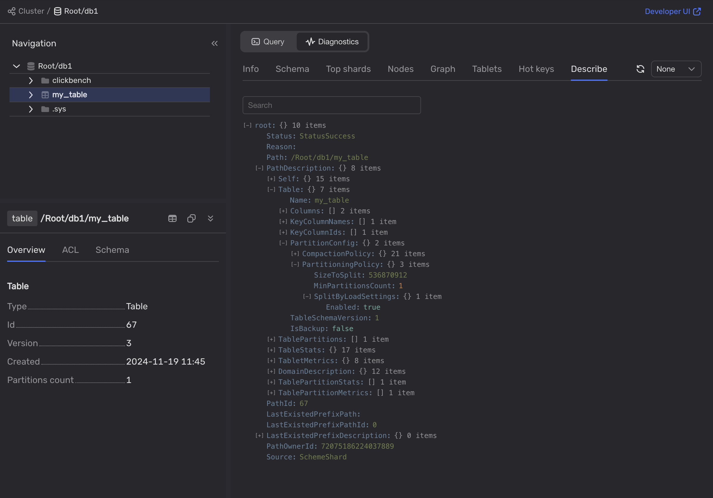

1. Используйте Встроенный UI или Grafana, чтобы проверить, не перегружены ли узлы {{ ydb-short-name }}:

    - На панели мониторинга Grafana **[DB overview](../../../../reference/observability/metrics/grafana-dashboards.md#dboverview)** проанализируйте диаграмму **Overloaded shard count**.

        

        Диаграмма отображает перегруженные таблетки data shard в кластере {{ ydb-short-name }}, но она не показывает таблицы, в которых есть перегруженные таблетки.

        

        Настройте уведомления в Grafana о перегрузках таблеток data shard.

        

    - Во [Встроенном UI](../../../../reference/embedded-ui/index.md):

        1. Перейдите на вкладку **Databases** и выберите базу данных.

        1. На вкладке **Navigation** убедитесь, что база данных выбрана.

        1. Откройте вкладку **Diagnostics**.

        1. Откройте вкладку **Top shards**.

        1. На вкладках **Immediate** и **Historical** отсортируйте таблетки по колонке **CPUCores** и проанализируйте информацию.

        

        Кроме того, информация о перегруженных таблетках представлена в виде системной таблицы. Дополнительные сведения см. в разделе [{#T}](../../../../dev/system-views.md#top-overload-partitions).

1. Чтобы точно определить проблему со схемой, используйте [Встроенный UI](../../../../reference/embedded-ui/index.md) или [{{ ydb-short-name }} CLI](../../../../reference/ydb-cli/index.md):

    - Во [Встроенном UI](../../../../reference/embedded-ui/index.md):

        1. На вкладке **Databases** нажмите на базу данных.

        1. На вкладке **Navigation** выберите требуемую базу данных.

        1. Откройте вкладку **Diagnostics**.

        1. На вкладке **Describe** перейдите на страницу `root > PathDescription > Table > PartitionConfig > PartitioningPolicy`.

            

        1. Проанализируйте значения **PartitioningPolicy**:

            - `SizeToSplit`
            - `SplitByLoadSettings`
            - `MaxPartitionsCount`

            Если в таблице не отображаются вышеперечисленные параметры, см. [Рекомендации по конфигурации таблиц](../overloaded-shards.md#table-config).

        

        Эта информация также отображается на вкладке **Diagnostics > Info**.

        


    - В [{{ ydb-short-name }} CLI](../../../../reference/ydb-cli/index.md):

        1. Чтобы получить информацию о проблемной таблице, выполните следующую команду:

            ```bash
            ydb scheme describe <table_name>
            ```

        2. В выводе команды проанализируйте **Auto partitioning settings**:

            - `Partitioning by size`
            - `Partitioning by load`
            - `Max partitions count`

            Если в таблице не указаны эти параметры, см. [Рекомендации по конфигурации таблиц](../overloaded-shards.md#table-config).

1. Проанализируйте, монотонно ли увеличиваются значения первичного ключа:

    - Проверьте тип данных столбца первичного ключа. Типы данных `Serial` используются для автоматического увеличения значений.

    - Проверьте логику приложения.

    - Вычислите разницу между минимальным и максимальным значениями столбца первичного ключа. Затем сравните это значение с количеством строк в данной таблице. Если эти значения совпадают, возможно первичный ключ в этой таблице увеличивается монотонно.

    Если значения первичного ключа действительно увеличиваются монотонно, см. [Рекомендации для несбалансированного первичного ключа](../overloaded-shards.md#pk-recommendations).
