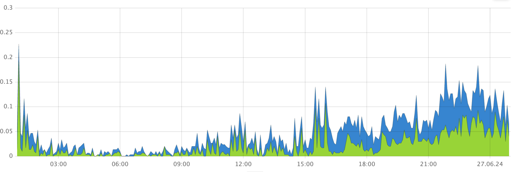
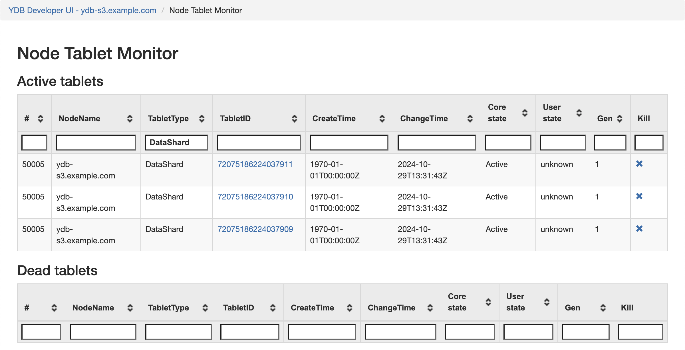

1. Посмотрите, есть ли всплески на графике **Split / Merge partitions** на панели мониторинга Grafana **[DB status](../../../../reference/observability/metrics/grafana-dashboards.md#dbstatus)**.

    

    На этой диаграмме отображаются временные ряды следующих данных:

    - количество разделений партиций таблиц в секунду (синий);
    - количество слияний партиций таблиц в секунду (зелёный).

1. Проверьте, не увеличилась ли пользовательская нагрузка, когда был замечен всплеск количества разделений и слияний таблеток.

    [//]: # (TODO: Add user load charts)

    - Просмотрите диаграммы на панели мониторинга **DataShard** в Grafana на предмет любых изменений в объёме данных, считываемых или записываемых запросами.

    - Изучите диаграмму **Requests** на панели мониторинга **Query engine** в Grafana на предмет увеличения количества запросов.

1. Чтобы определить недавно разделённые или слитые таблетки, выполните следующие шаги:

    1. Во [Встроенном UI](../../../../reference/embedded-ui/index.md) нажмите на ссылку **Developer UI** в правом верхнем углу.

    1. Перейдите на страницу **Node Table Monitor** > **All tablets of the cluster**.

    1. Для отображения только таблеток data shard в фильтре **TabletType** укажите `DataShard`.

        

    1. Отсортируйте таблетки по колонке **ChangeTime**. Обратите внимание на таблетки, значения времени изменения которых совпадают с пиковыми значениями на диаграмме **Split / Merge partitions**.

    1. Чтобы определить таблицу, связанную с таблеткой data shard, в строке data shard нажмите на ссылку в столбце **TabletID**.

    1. На странице **Tablets** откройте ссылку **App**.

        Информация о таблице отображается в секции **User table \<имя таблицы\>**.

1. Чтобы определить, связана ли проблема с неправильной схемой таблицы, выполните следующие шаги:

    1. Получите информацию о проблемной таблице с помощью [{{ ydb-short-name }} CLI](../../../../reference/ydb-cli/index.md). Выполните следующую команду:

        ```bash
        ydb scheme describe <имя_таблицы>
        ```

    1. В выводе команды проанализируйте **Auto partitioning settings**:

        * `Partitioning by load`
        * `Max partitions count`
        * `Min partitions count`
