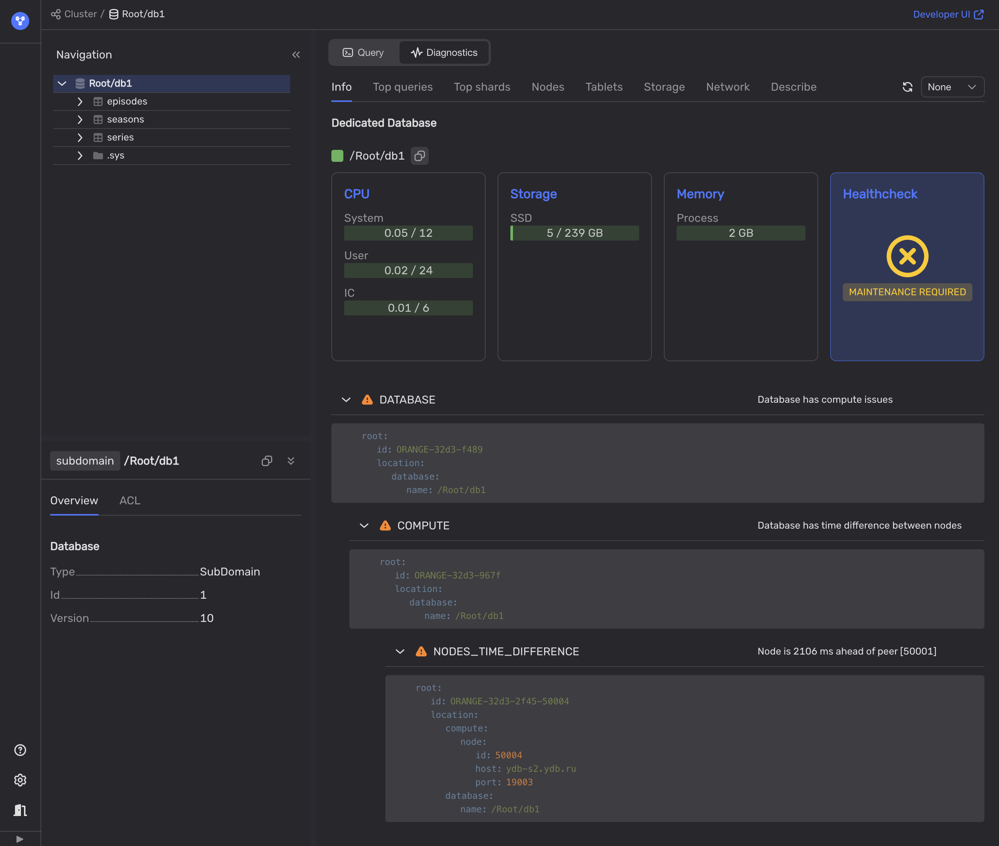

# Расхождение системного времени между серверами

Синхронизированное время на серверах баз данных имеет важное значение для распределённых баз данных. Если системные часы на серверах {{ ydb-short-name }} будут сильно расходиться, это приведёт к увеличению задержек в распределённых транзакциях.



Важно поддерживать системное время на серверах {{ ydb-short-name }} в синхронном состоянии, чтобы избегать больших задержек.



Если системное время узлов, на которых запущены [таблетки-координаторы](../../../concepts/glossary.md#coordinator), отличается друг от друга, задержки транзакций увеличиваются на величину разницы во времени между самыми быстрыми и самыми отстающими системными часами. Это происходит потому, что транзакция, запланированная на узле с более быстрыми системными часами, может быть выполнена только после того, как координатор с самыми отстающими часами достигнет того же времени.

Более того, если отклонение во времени превысит 30 секунд, система {{ ydb-short-name }} откажется обрабатывать распределённые транзакции. Перед тем как координаторы приступят к планированию транзакции, задействованные [data shards](../../../concepts/glossary.md#data-shard) определяют допустимый диапазон временных меток (timestamps) для транзакции. Начало этого диапазона — текущее системное время таблетки-медиатора, а конец определяет тайм-аут планирования в 30 секунд. Если системное время координатора выходит за пределы этого временного диапазона, он не может запланировать распределённую транзакцию, что приводит к ошибкам в таких запросах.

## Диагностика

Чтобы диагностировать расхождение в системном времени серверов {{ ydb-short-name }}, используйте следующие методы:

1. Используйте **Healthcheck** во [Встроенном UI](../../../reference/embedded-ui/index.md):

    1. Во [Встроенном UI](../../../reference/embedded-ui/index.md) перейдите на вкладку **Databases** и нажмите на наименование базы данных.

    1. На вкладке **Navigation** убедитесь, что требуемая база данных выбрана.

    1. Откройте вкладку **Diagnostics**.

    1. На вкладке **Info** нажмите на кнопку **Healthcheck**.

        Если кнопка **Healthcheck** отображает статус `MAINTENANCE REQUIRED`, возможно, в кластере {{ ydb-short-name }} возникли проблемы, например, расхождение системных часов. Все выявленные неполадки будут перечислены в разделе **DATABASE** под кнопкой **Healthcheck**.

    1. Чтобы увидеть диагностированные неполадки, раскройте раздел **DATABASE**.

        

        Проблемы с расхождением системного времени отображаются в разделе `NODES_TIME_DIFFERENCE`.

    

    Для получения дополнительной информации см. [{#T}](../../../reference/ydb-sdk/health-check-api.md)

    

1. Откройте страницу [Interconnect overview](../../../reference/embedded-ui/interconnect-overview.md) во [Встроенном UI](../../../reference/embedded-ui/index.md).

1. Используйте такие инструменты, как `pssh` или `ansible`, чтобы выполнить команду (например, `date +%s%N`) на всех узлах {{ ydb-short-name }} и отобразить значение системных часов.

    

    На результаты будут влиять сетевые задержки между хостом, на котором запущены `pssh` или `ansible`, и хостами {{ ydb-short-name }}.

    

    Если вы используете утилиты синхронизации времени, вы также можете запросить их статус вместо запроса текущих временных меток. Например, `timedatectl show-timesync --all`.

## Рекомендации

1. Вручную синхронизируйте системные часы серверов, на которых работают узлы {{ ydb-short-name }}. Например, используйте `pssh` или `ansible`, чтобы выполнить команду синхронизации часов на всех узлах.

2. Убедитесь, что системные часы на всех серверах {{ ydb-short-name }} регулярно синхронизируются с помощью `timesyncd`, `ntpd`, `chrony` или аналогичного инструмента. Рекомендуется использовать один и тот же источник времени для всех серверов в кластере {{ ydb-short-name }}.
