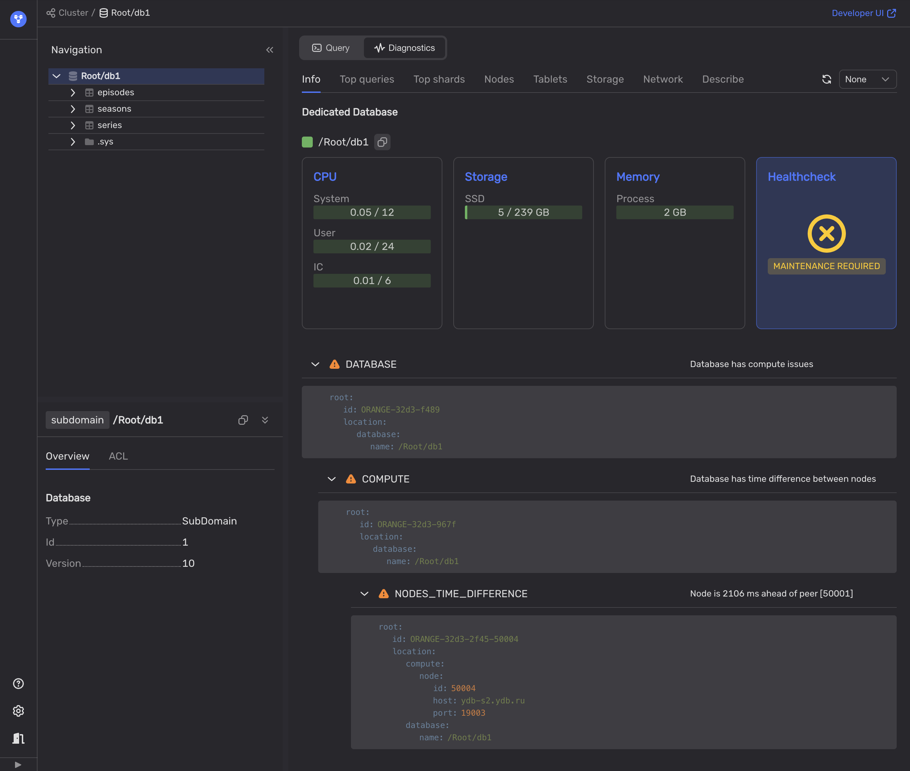

# Расхождение системного времени между серверами

Синхронизированное время на серверах баз данных имеет важное значение для распределённых баз данных. Если системные часы на серверах {{ ydb-short-name }} будут сильно расходиться, это приведёт к увеличению задержек в распределённых транзакциях.



Важно поддерживать системное время на серверах {{ ydb-short-name }} в синхронном состоянии, чтобы избегать больших задержек.



## Симптомы и пороги {#symptoms-thresholds}

Основные проявления расхождения времени между узлами:

* **Замедление распределённых транзакций** — время выполнения может увеличиваться примерно на величину расхождения часов между узлами (узел с более «быстрыми» часами ждёт согласования с узлами с отстающими часами).
* **Рост задержек и ошибок по таймаутам** — при рассинхронизации возможны ложные срабатывания дедлайнов и таймаутов запросов.
* **Проблемы с аутентификацией** — при сильном сдвиге времени возможны ошибки из‑за несогласованности сроков действия токенов и проверок на стороне сервисов.

При мониторинге расхождения времени между узлами ориентируйтесь на пороги (типичные уровни для наблюдаемости в кластере):

* **Менее 1 миллисекунды** — нормальный уровень для штатной работы кластера.
* **1 — 5 миллисекунд** — зона, в которой уже имеет смысл искать причину рассинхронизации и усиливать наблюдение.
* **Более 5 миллисекунд** — критический уровень: требуется срочная диагностика и выравнивание времени.
* **25 миллисекунд и выше** — нарастающая деградация производительности, пользователи получают массовые задержки и таймауты при выполнении распределённых транзакций.
* **30 секунд** — распределённые транзакции перестают выполняться (см. ниже).

Если системное время узлов, на которых запущены [таблетки-координаторы](../../../concepts/glossary.md#coordinator), заметно отличается друг от друга, задержки транзакций увеличиваются на величину разницы во времени между самыми быстрыми и самыми отстающими системными часами. Это происходит потому, что транзакция, запланированная на узле с более быстрыми системными часами, может быть выполнена только после того, как узел с самыми отстающими часами достигнет того же времени.

Более того, если отклонение во времени превысит 30 секунд, система {{ ydb-short-name }} откажется обрабатывать распределённые транзакции. Перед тем как координаторы приступят к планированию транзакции, задействованные [data shards](../../../concepts/glossary.md#data-shard) определяют допустимый диапазон временных меток для транзакции. Начало этого диапазона — текущее системное время таблетки-медиатора, а конец определяет тайм-аут планирования в 30 секунд. Если системное время координатора выходит за пределы этого временного диапазона, он не может запланировать распределённую транзакцию, что приводит к ошибкам в таких запросах.

## Диагностика

Чтобы диагностировать расхождение в системном времени серверов {{ ydb-short-name }}, используйте следующие методы:

1. Используйте **Healthcheck** во [Встроенном UI](../../../reference/embedded-ui/index.md):

    1. Во [Встроенном UI](../../../reference/embedded-ui/index.md) перейдите на вкладку **Databases** и нажмите на наименование базы данных.

    1. На вкладке **Navigation** убедитесь, что требуемая база данных выбрана.

    1. Откройте вкладку **Diagnostics**.

    1. На вкладке **Info** нажмите на кнопку **Healthcheck**.

        Если кнопка **Healthcheck** отображает статус `MAINTENANCE REQUIRED`, возможно, в кластере {{ ydb-short-name }} возникли проблемы, например, расхождение системных часов. Все выявленные неполадки будут перечислены в разделе **DATABASE** под кнопкой **Healthcheck**.

    1. Чтобы увидеть диагностированные неполадки, раскройте раздел **DATABASE**.

        

        Проблемы с расхождением системного времени отображаются в разделе `NODES_TIME_DIFFERENCE`.

    

    Для получения дополнительной информации см. [{#T}](../../../reference/ydb-sdk/health-check-api.md)

    


1. Откройте страницу [Interconnect overview](../../../reference/embedded-ui/interconnect-overview.md) во [Встроенном UI](../../../reference/embedded-ui/index.md). По метрикам interconnect (в т.ч. связанным с рассинхронизацией часов между узлами) можно оценить масштаб проблемы вместе с общей картиной задержек и ошибок соединений.

    

    Увеличение расхождения системного времени по данным мониторинга интерконнекта (как отображаемым во Встроенном UI, так и собираемым через метрики кластера) может быть связано как с фактическим расхождением часов, так и с исчерпанием ресурсов в процессорном пуле интерконнекта, либо с перегрузкой сетевого оборудования.

    

1. Используйте такие инструменты, как `pssh` или `ansible`, чтобы выполнить команду (например, `date +%s%N`) на всех узлах {{ ydb-short-name }} и отобразить значение системных часов.

    

    На результаты будут влиять сетевые задержки между хостом, на котором запущены `pssh` или `ansible`, и хостами {{ ydb-short-name }}.

    

    Если вы используете утилиты синхронизации времени, вы также можете запросить их статус вместо запроса текущих временных меток. Например:

    ```bash
    chronyc sources -v
    ```

Дополнительно полезно смотреть на метрики мониторинга кластера (если они у вас собираются): задержки транзакций, долю успешных gRPC-запросов — на фоне рассинхронизации времени они могут деградировать совместно с показателями interconnect (в частности, метрикой `interconnect.ClockSkewMicrosec`).

## Рекомендации

1. Вручную синхронизируйте системные часы серверов, на которых работают узлы {{ ydb-short-name }}. Например, используйте `pssh` или `ansible`, чтобы выполнить команду синхронизации часов на всех узлах.

2. Убедитесь, что системные часы на всех серверах {{ ydb-short-name }} регулярно синхронизируются с помощью `ntpd`, `chrony` или аналогичного инструмента. Используйте один и тот же логический источник времени (одинаковый набор NTP-серверов или иерархию NTP) для всех серверов в кластере {{ ydb-short-name }}, и подключите несколько независимых NTP-источников.



Использование сервиса **systemd-timesyncd** не рекомендовано, поскольку этот тип клиента NTP не обеспечивает достаточную точность синхронизации системного времени. Вместо него следует использовать другие инструменты, например `chrony` или `ntpd`.



### Примеры конфигурации NTP {#ntp-examples}

Ниже — примеры настроек для `chrony`. Список серверов замените на актуальный для вашей среды и политики безопасности.

**chrony** (`/etc/chrony/chrony.conf`):

```bash
server ntp1.example.net iburst
server ntp2.example.net iburst
server ntp3.example.net iburst
server ntp4.example.net iburst
maxslewrate 10000
local stratum 10
```

### Мониторинг и алертинг {#monitoring}

Настройте оповещения по расхождению времени между узлами и по связанным симптомам (в том числе по данным встроенного UI и внешнего мониторинга). Ориентиры по порогам см. в разделе [«Симптомы и пороги»](#symptoms-thresholds).

### Аварийное восстановление {#emergency}

При критическом расхождении времени может потребоваться принудительная синхронизация на узлах (выполняйте осознанно и по согласованной процедуре для вашего кластера):

```bash
# Пример для chrony: остановка службы и однократная подстройка
sudo systemctl stop chrony
sudo chronyd -q 'server ntp1.example.net iburst'
sudo systemctl start chrony
```

Рекомендуемый порядок действий на кластере:

1. Убедиться, что используются корректные и доступные NTP-серверы.
2. Выровнять время на всех узлах (без рассогласования конфигурации между узлами).
3. Проверить сходимость времени через Healthcheck и мониторинг.
4. Зафиксировать причину сбоя синхронизации (сеть, DNS, блокировки исходящего NTP и т.д.).

### Профилактика {#prevention}

* Регулярно проверяйте метрики и отчёты Healthcheck на предмет роста расхождения времени.
* Периодически проверяйте отказоустойчивость цепочки синхронизации (несколько NTP-серверов, доступность порта UDP 123 при необходимости).
* Держите конфигурацию используемого клиента NTP согласованной на всех узлах кластера.
