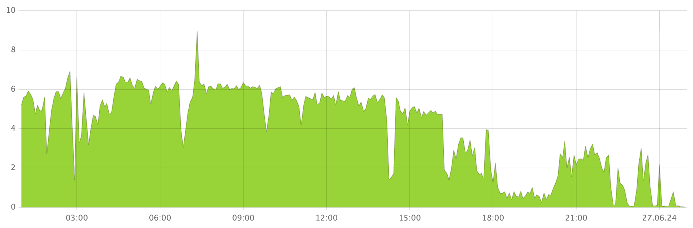
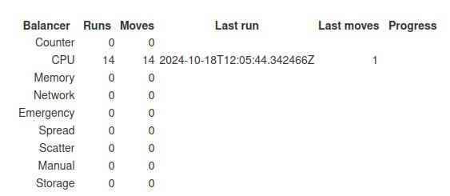

1. Посмотрите, отображаются ли всплески на графике **Tablets moved by Hive** на панели мониторинга Grafana **[DB status](../../../../reference/observability/metrics/grafana-dashboards.md#dbstatus)**.

    

    На этой диаграмме отображаются данные о количестве таблеток, перемещаемых между узлами {{ ydb-short-name }} в секунду.

1. Проанализируйте статистику балансировщика Hive.

    1. Откройте [Встроенный UI](../../../../reference/embedded-ui/index.md).

    1. Нажмите на ссылку **Developer UI** в правом верхнем углу Встроенного UI.

    1. В **Developer UI** перейдите на страницу **Tablets > Hive > App**.

        Проанализируйте статистику балансировщика в правом верхнем углу.

        

    1. Кроме того, чтобы просмотреть недавно перемещённые таблетки, нажмите на кнопку **Balancer**.

        Откроется окно **Balancer**, в котором список недавно перемещённых таблеток отображается в секции **Latest tablet moves**.
