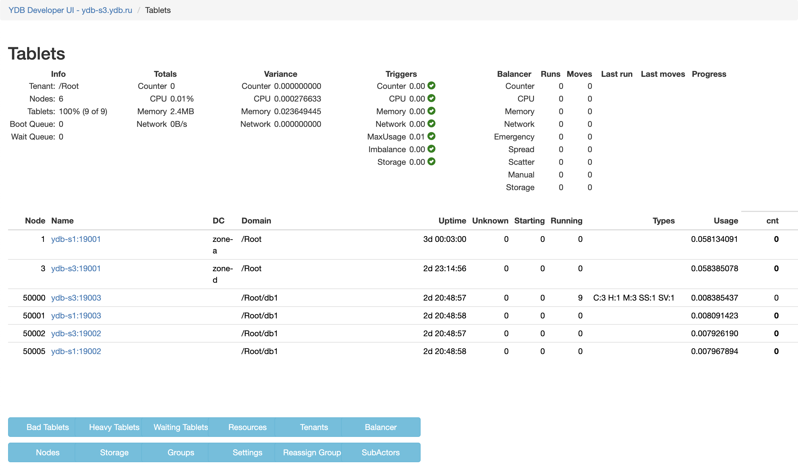

# Частые переезды таблеток между узлами

{{ ydb-short-name }} автоматически распределяет нагрузку, перемещая таблетки с перегруженных узлов на другие узлы. Этот процесс управляется компонентом [Hive](../../../concepts/glossary.md#hive). Когда Hive перемещает таблетки, запросы, затрагивающие эти таблетки, могут выполняться дольше из-за ожидания инициализации таблетки на новом узле.

Для балансировки нагрузки между узлами {{ ydb-short-name }} учитывает использование следующих аппаратных ресурсов:

- процессор;
- оперативная память;
- сетевой трафик;
- [count](*count).

Балансировка выполняется автоматически в следующих случаях:

- **Дисбаланс потребления аппаратных ресурсов**

    Для оценки сбалансированности потребления аппаратных ресурсов {{ ydb-short-name }} использует метрику **scatter**, вычисляемую отдельно для каждого ресурса по формуле

    $Scatter = \frac {MaxUsage - MinUsage} {MaxUsage},$

    где:

    - $MaxUsage$ — максимум по потреблению данного ресурса среди всех узлов;
    - $MinUsage$ — минимум по потреблению данного ресурса среди всех узлов.

    Для нормирования потребления на каждом узле используется объём доступных ресурсов на узле, который может различаться между узлами. При низких нагрузках эта величина может сильно колебаться. Чтобы этого избежать, при вычислении **scatter** считается, что потребление ресурса не может быть ниже 30%. Если **scatter** превышает порог, запускается балансировка.

- **Перегруженность узла (по использованию процессора и памяти)**

    Hive запускает балансировку, если самый загруженный узел имеет загрузку больше 90%, а наименее загруженный — меньше 70%.

- **Неравномерное распределение конкретного объекта**

    Для таблеток, которые используют ресурс **[count](*count)**, также отслеживается равномерность распределения таблеток каждого объекта (каждой таблицы), с помощью метрики ObjectImbalance, аналогичной описанной выше **scatter**. При рестартах узлов равномерность может нарушаться, и тогда запускается балансировка.

## Диагностика

<!-- The include is added to allow partial overrides in overlays  -->


## Рекомендации

Измените настройки балансировщика Hive:

1. Откройте [Встроенный UI](../../../reference/embedded-ui/index.md).

1. Нажмите на ссылку **Developer UI** в правом верхнем углу Встроенного UI.

1. В **Developer UI** перейдите на страницу **Tablets > Hive > App**.

    

1. Нажмите на **Settings**.

1. Чтобы снизить вероятность слишком частой балансировки, увеличьте следующие пороговые значения балансировщика Hive:

    #|
    || Параметр | Описание | Значение по умолчанию ||
    || MinCounterScatterToBalance
    | Пороговое значение для значения разброса ресурса counter. При достижении этого значения Hive начинает балансировать нагрузку
    | 0.02 ||
    || MinCPUScatterToBalance
    | Пороговое значение для значения разброса ресурса процессора. При достижении этого значения Hive начинает балансировать нагрузку
    | 0.5 ||
    || MinMemoryScatterToBalance
    | Пороговое значение для значения разброса ресурса оперативной памяти. При достижении этого значения Hive начинает балансировать нагрузку
    | 0.5 ||
    || MinNetworkScatterToBalance
    | Пороговое значение для значения разброса ресурса сетевого трафика. При достижении этого значения Hive начинает балансировать нагрузку
    | 0.5 ||
    || MaxNodeUsageToKick
    | Пороговое значение использования ресурсов узла {{ ydb-short-name }}. При достижении этого значения Hive начинает срочную балансировку
    | 0.9 ||
    || ObjectImbalanceToBalance
    | Пороговое значение метрики дисбаланса объекта базы данных
    | 0.02 ||
    |#

    

    В этих параметрах используются относительные значения, где 1.0 соответствует 100% и фактически отключает балансировку. Если общее значение аппаратных ресурсов может превышать 100%, скорректируйте значение настройки соответствующим образом.

    

[*count]: Count — фиктивный ресурс, используемый для равномерного распределения таблеток одного типа между узлами.
