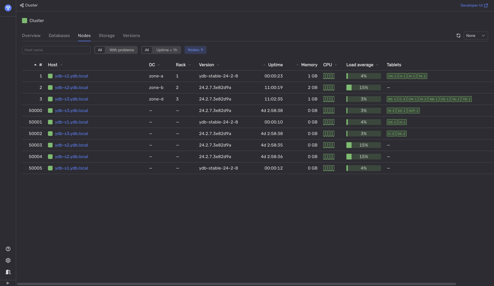

# Процедура последовательного перезапуска

Кластеры {{ ydb-short-name }} могут обновляться без простоев, поскольку обычно они содержат избыточные компоненты и поддерживает процедуру последовательного перезапуска. Чтобы обеспечить постоянную доступность данных, {{ ydb-short-name }} включает в себя [систему управления кластером (CMS)](../../../concepts/glossary.md#cms), которая отслеживает все сбои в работе и узлы, отключённые для обслуживания, например при перезапуске. CMS останавливает новые запросы на обслуживание, если они могут поставить под угрозу доступность данных.

Однако, даже если данные всегда доступны, перезапуск всех узлов за относительно короткий промежуток времени может оказать заметное влияние на общую производительность. Каждая [таблетка](../../../concepts/glossary.md#tablet), которая выполнялась на перезапускаемом узле, будет запущена снова на другом узле. Перемещение таблетки между узлами требует времени и может повлиять на задержки запросов, связанных с ней. Смотрите рекомендации [по процедуре последовательного перезапуска](#rolling-restart).

Кроме того, новая версия {{ ydb-short-name }} может обрабатывать запросы по-другому. Хотя производительность, как правило, повышается с каждым обновлением, в некоторых пограничных случаях производительность может снижаться. Смотрите рекомендации [по производительности разных версий](#version-performance).

## Диагностика



Диагностика последовательных перезапусков и обновлений {{ ydb-short-name }} основана только на вторичных признаках. Чтобы быть абсолютно уверенным в том, что происходит обновление или последовательный перезапуск узлов, обратитесь к администратору вашей базы данных.



Чтобы проверить, не обновляется ли {{ ydb-short-name }} кластер:

1. Откройте [Встроенный UI](../../../reference/embedded-ui/index.md).

1. На вкладке **Nodes** проверьте, отличаются ли версии {{ ydb-short-name }} на узлах.

    Также проверьте, имеют ли узлы с новой версией {{ ydb-short-name }} более низкие значения времени с момента запуска (uptime).

    



Низкий uptime узла {{ ydb-short-name }} может также указывать на другие проблемы. Например, см. [{#T}](../hardware/insufficient-memory.md).



## Рекомендации

### В случае последовательного перезапуска {#rolling-restart}

Если из-за процесса последовательного перезапуска кластера {{ ydb-short-name }} задержки приложения вырастают выше критического уровня, подумайте о том, чтобы замедлить процесс перезапуска:

1. Если узлы перезапускаются группами, сократите размер групп, вплоть до одного узла за раз.

1. Разнесите во времени перезагрузки в каждом датацентре и/или серверной стойке.

1. Вставьте дополнительные паузы между перезагрузками.

### В случае отличий в работе разных версий {#version-performance}

Целью является как можно более раннее обнаружение негативного влияния новой версии {{ ydb-short-name }} на скорость выполнения определённых запросов в конкретной пользовательской нагрузке:

1. Просмотрите [список изменений {{ ydb-short-name }} сервера](../../../changelog-server.md), обращая особое внимание на изменения, связанные с производительностью и относящиеся к вашей рабочей нагрузке.

1. Используйте выделенный кластер для тестирования {{ ydb-short-name }} под нагрузкой, которая настолько точно соответствует вашей рабочей нагрузке, насколько это возможно. Всегда сначала развёртывайте новую версию {{ ydb-short-name }} на таких кластерах, чтобы оценить влияние новой версии в тестовом окружении. Отслеживайте задержки как на стороне клиента, так и на стороне сервера, чтобы выявить любые потенциальные проблемы с производительностью.

1. Используйте канареечное развертывание (canary deployment), обновив сначала только один узел кластера и проанализировав любые изменения в его поведении. Если всё выглядит стабильно, постепенно распространите обновление на большее количество узлов, например, на всю серверную стойку или датацентр, и повторяйте проверки на наличие аномалий. Если возникнут какие-либо проблемы, немедленно вернитесь к предыдущей версии и попытайтесь воспроизвести проблему в тестовой среде.

Сообщайте о любых выявленных проблемах с производительностью на [GitHub {{ ydb-short-name }}](https://github.com/ydb-platform/ydb/issues/new). Предоставьте контекст и все детали, которые могут помочь воспроизвести проблему.
