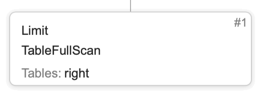

# Структура планов запросов

Чтобы лучше понимать работу запроса, вы можете получить и проанализировать его план.
Структура плана запроса в {{ ydb-short-name }} представляет собой граф, где каждый узел содержит информацию об операциях и таблицах.

Ниже представлена справочная информация по типам узлов, а пример анализа конкретного плана запроса можно посмотреть [здесь](../dev/query-plans-optimization.md).

## Типы узлов
### Stage
Стадия выполнения запроса.

**Визуальное представление**:

Стадия может содержать следующие операции:

#### TableFullScan
Полное сканирование таблицы. Важно иметь ввиду, что ресурсоёмкость данной операции пропорциональна размеру таблицы, поэтому по возможности ее стоит избегать.

Атрибут | Значение
--- | ---
Table | имя таблицы
ReadColumns | список читаемых колонок
ReadLimit | лимит на число прочитанных строк
Reverse | флаг, указывающий на порядок, в котором будут прочитаны строки, по умолчанию порядок прямой (от меньшего к большему), но в случае выставления флага в `true` порядок чтения будет обратным

#### TableRangeScan
Чтение строк таблицы по определённому диапазону значений первичного ключа.

Атрибут | Значение
--- | ---
Table | имя таблицы
ReadColumns | список читаемых колонок
ReadRange | диапазон ключей, по которому выполняется чтение
ReadLimit | лимит на число прочитанных строк
Reverse | флаг, указывающий на порядок, в котором будут прочитаны строки, по умолчанию порядок прямой (от меньшего к большему), но в случае выставления флага в `true` порядок чтения будет обратным

#### TablePointLookup
Чтение строк таблицы по конкретным значениям первичного ключа. Обратите внимание, что для этой операции необходимо указать все компоненты первичного ключа, чтение по префиксу ключа выполняется как `TableRangeScan`.

Атрибут | Значение
--- | ---
Table | имя таблицы
ReadColumns | список читаемых колонок

#### Upsert
Перезапись строк таблицы по соответствующим значениям первичного ключа, если они существовали, иначе добавление новых строк.

Атрибут | Значение
--- | ---
Table | имя таблицы
Columns | колонки, которые содержит строка

#### Delete
Удаление строк из таблицы.

Атрибут | Значение
--- | ---
Table | имя таблицы

#### Join
Объединение двух таблиц, в описании операции указана используемая стратегия (JoinDict или MapJoin).

- JoinDict - строятся словари для правой и левой частей, а затем выполняется их объединение по ключам
- MapJoin - для каждого элемента из левой части выполняется поиск по ключу в предварительно построенном словаре для правой части

#### Filter
Фильтрация строк, в результате остаются только те строки, для которых предикат оказался true.

Атрибут | Значение
--- | ---
Predicate | условие фильтрации
Limit | лимит на число строк

#### Aggregate
Группировка строк по значениям колонок с построением агрегатов.

Атрибут | Значение
--- | ---
GroupBy | колонки, по которым выполняется группировка
Aggregation | агрегатные функции

#### Sort
Сортировка строк.

Атрибут | Значение
--- | ---
SortBy | колонки, по которым выполняется сортировка

#### TopSort
Сортировка строк с применением лимита.

Атрибут | Значение
--- | ---
TopSortBy | колонки, по которым выполняется сортировка
Limit | лимит на число строк

#### Top
Взятие N элементов таким образом, что все они меньше или равны N+1 элемента, если бы вся последовательность была отсортирована.

Атрибут | Значение
--- | ---
TopBy | колонки, по которым будут взяты первые N строк
Limit | лимит на число строк

#### Limit
Ограничение на число строк.

Атрибут | Значение
--- | ---
Limit | величина лимита

#### Offset
Смещение, позволяющее пропустить первые N элементов заданного набора строк.

Атрибут | Значение
--- | ---
Offset | величина смещения

#### Union
Объединение результатов двух и более подзапросов в один набор.

#### Iterator
Итератор по заданному набору строк, как правило в качестве аргумента принимает [precompute](#precompute).

#### PartitionByKey
Партиционирование по ключу, как правило в качестве аргумента принимает [precompute](#precompute).

### Connection
Зависимость по данным между стадиями.

**Визуальное представление**:

Каждая стадия исполняется в виде некоторого количества тасков. Например, читающая таблицу стадия может исполняться в N тасков, где N - это количество шардов таблицы. От того, какой connection используется, зависит как именно данные будут передаваться между стадиями. Далее будут описаны все возможные типы connection'ов, для их описания удобно ввести термины producer stage - стадия, отправляющая данные и consumer stage - стадия,  принимающая данные.

#### UnionAll
Объединяет результаты всех тасков producer stage и отдаёт их как единый результат в единственный таск consumer stage.

#### Merge
Частный случай `UnionAll`, когда результаты producer stage отсортированы по заданному набору колонок, результат также отсортирован.

#### Broadcast
Рассылает результат единственного таска producer stage на все таски consumer stage.

#### Map
Реализует связи тасков стадий 1-к-1, то есть producer stage и consumer stage должны иметь одинаковое количество тасков.

#### HashShuffle
Рассылает результаты с тасков producer stage на таски consumer stage по некоторому правилу для заданных колонок. Правило жётско описано в коде, но вот список колонок указывается в каждом connection'е независимо.

### ResultSet
Результат выполнения запроса, возвращаемый клиенту.

**Визуальное представление**:

### Precompute
Материализованный в памяти промежуточный результат.

**Визуальное представление**:

Cтадии, использующие precompute, начинают выполняться только после завершения вычисления precompute.
