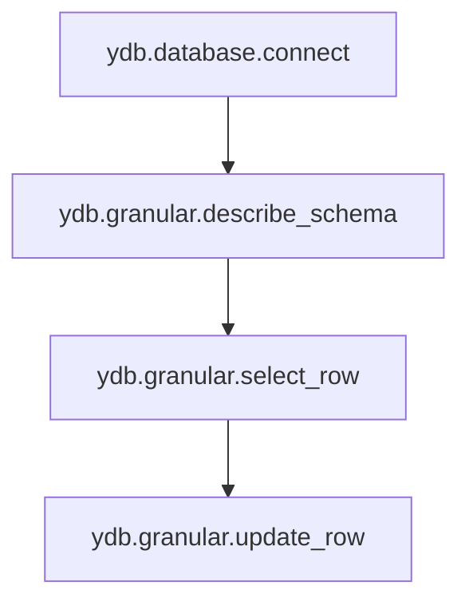

## Права доступа {#permissions-list}

В качестве имён прав доступа можно использовать имена {{ ydb-short-name }} прав или соответствующие им ключевые слова YQL.
В таблице ниже перечислены возможные имена прав.

{{ ydb-short-name }} право | Ключевое слово YQL | Описание
--- | --- | ---
Права уровня баз данных
`ydb.database.connect` | `CONNECT` | Право подключаться к базе данных
`ydb.database.create` | `CREATE` | Право создавать новые базы данных в кластере
`ydb.database.drop` | `DROP` | Право удалять базы данных в кластере
Элементарные права на объекты базы данных
`ydb.granular.select_row` | `SELECT ROW` | Право читать строки из таблицы (select), читать сообщения из топиков
`ydb.granular.update_row` | `UPDATE ROW` | Право обновлять строки в таблице (insert, update, upsert, replace), писать сообщения в топики
`ydb.granular.erase_row` | `ERASE ROW` | Право удалять строки из таблицы (delete)
`ydb.granular.create_directory` | `CREATE DIRECTORY` | Право создавать и удалять директории, в том числе существующие и вложенные
`ydb.granular.create_table` | `CREATE TABLE` | Право создавать таблицы (в том числе индексные, внешние, колоночные), представления, последовательности
`ydb.granular.create_queue` | `CREATE QUEUE` | Право создавать топики
`ydb.granular.remove_schema` | `REMOVE SCHEMA` | Право удалять объекты (директории, таблицы, топики), которые были созданы посредством использования прав
`ydb.granular.describe_schema` | `DESCRIBE SCHEMA` | Право просмотра имеющихся прав доступа (ACL) на объект доступа, просмотра описания объектов доступа (директории, таблицы, топики)
`ydb.granular.alter_schema` | `ALTER SCHEMA` | Право изменять объекты доступа (директории, таблицы, топики), в том числе права пользователей на объекты доступа
Дополнительные флаги
`ydb.access.grant` | `GRANT` | Право предоставлять или отзывать права у других пользователей в объёме, не превышающем текущий объём прав пользователя на объекте доступа
Права, основанные на других правах
`ydb.tables.modify` | `MODIFY TABLES` | `ydb.granular.update_row` + `ydb.granular.erase_row`
`ydb.tables.read` | `SELECT TABLES` | Синоним `ydb.granular.select_row`
`ydb.generic.list` | `LIST` | Синоним `ydb.granular.describe_schema`
`ydb.generic.read` | `SELECT` | `ydb.granular.select_row` + `ydb.generic.list`
`ydb.generic.write` | `INSERT` | `ydb.granular.update_row` + `ydb.granular.erase_row` + `ydb.granular.create_directory` + `ydb.granular.create_table` + `ydb.granular.create_queue` + `ydb.granular.remove_schema` + `ydb.granular.alter_schema`
`ydb.generic.use_legacy` | `USE LEGACY` | `ydb.generic.read` + `ydb.generic.write` + `ydb.access.grant`
`ydb.generic.use` | `USE` | `ydb.generic.use_legacy` + `ydb.database.connect`
`ydb.generic.manage` | `MANAGE` | `ydb.database.create` + `ydb.database.drop`
`ydb.generic.full_legacy` | `FULL LEGACY` | `ydb.generic.use_legacy` + `ydb.generic.manage`
`ydb.generic.full` | `FULL` | `ydb.generic.use` + `ydb.generic.manage`

* `ALL [PRIVILEGES]` - используется для указания всех возможных прав на объекты схемы для пользователей или групп. `PRIVILEGES` является необязательным ключевым словом, необходимым для совместимости с SQL стандартом.



Права `ydb.database.connect`, `ydb.granular.describe_schema`, `ydb.granular.select_row`, `ydb.granular.update_row` необходимо рассматривать как слои прав.

Например, для изменения строк необходимо не только право `ydb.granular.update_row`, но и все вышележащие права.


