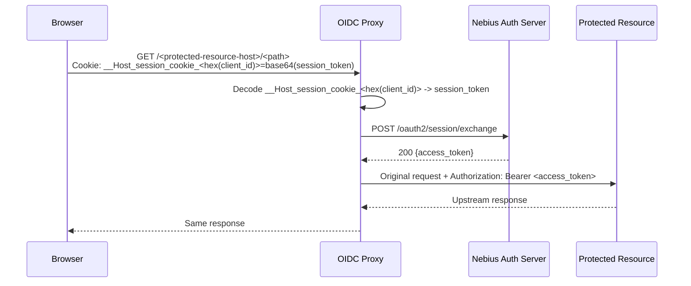
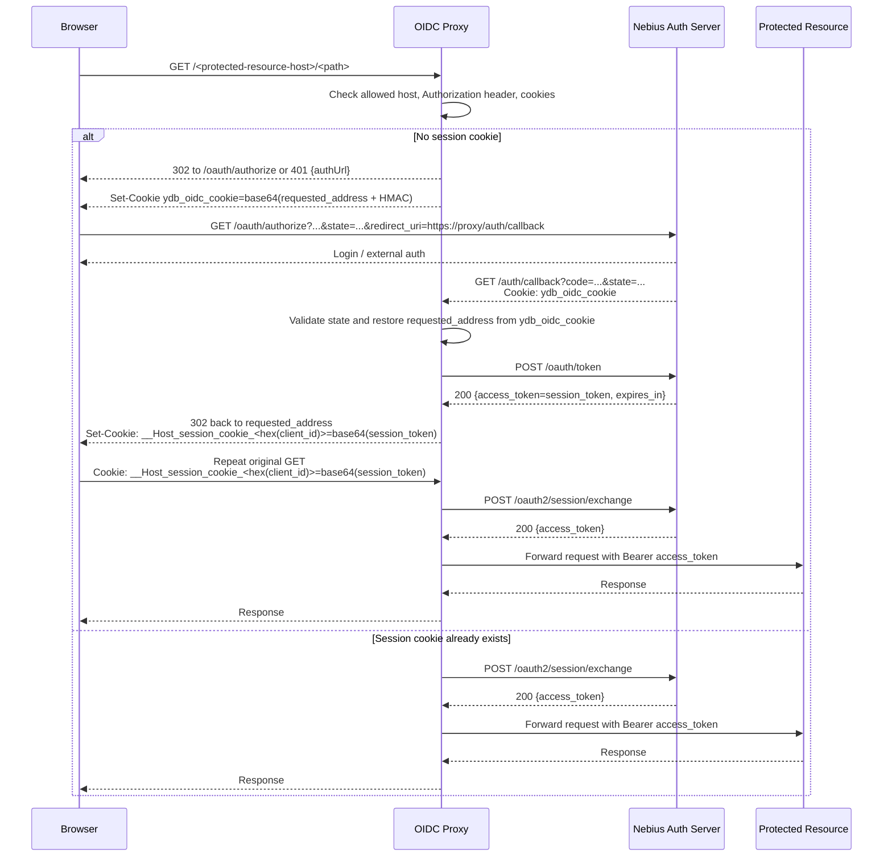

# Nebius OIDC Proxy Auth Flow

Документ описывает, как работает `ydb/mvp/oidc_proxy` для `access_service_type = nebius_v1`
в состоянии дерева на коммите `621e8550a009af531760cd5b2be3dd7c3ce0ba8a`.

Важно: сам этот коммит не меняет OIDC-код, но ниже описано именно то поведение, которое видно
в файлах под этим SHA.

## Что именно здесь описано

Фокус документа:

- как прокси начинает OIDC authentication flow;
- как он обменивает `authorization code` на Nebius `session token`;
- как потом на каждый пользовательский запрос он меняет `session token` на обычный `access token`;
- какие cookies и redirect'ы участвуют в процессе;
- какие есть важные особенности и ограничения этой реализации.

## Короткая версия для обсуждения

Если цель только понять, как устроена аутентификация и почему решение в этом snapshot
вызывает вопросы, достаточно этого раздела.

### Тезаурус

- `OIDC proxy` - сервис между браузером и `protected resource`, который организует логин и сам работает с токенами.
- `Authorization Server` - Nebius-сервис, который логинит пользователя и выдает токены или коды для продолжения flow.
- `protected resource` - целевой сервис или страница, куда пользователь в итоге хочет попасть.
- `authorization code` или `code` - короткоживущий код, который Authorization Server возвращает в `/auth/callback` после успешного логина.
- `state` - одноразовый идентификатор login flow. Он нужен, чтобы callback можно было связать с правильным запросом на логин.
- `temporary context cookie` - временная cookie, в которой прокси хранит контекст login flow: например, на какую страницу нужно вернуть пользователя после логина.
- `session token` - промежуточный токен, который прокси кладет в cookie браузера после callback. По нему прокси потом получает рабочий токен для `protected resource`.
- `access token` - рабочий токен, с которым прокси идет в `protected resource`.
- `session cookie` - cookie браузера, в которой прокси хранит `session token`.

Важно для этого snapshot:

- браузер не получает рабочий `access token` для `protected resource`;
- браузер хранит `session token` в cookie;
- в ответе token endpoint этот `session token` приходит в поле `access_token`, но дальше в коде используется именно как `session token`.

### Кто участвует

- Браузер пользователя
- OIDC proxy
- Nebius Authorization Server
- `protected resource`

### Как работает flow простыми словами

1. Пользователь открывает страницу через OIDC proxy.
2. Если у прокси еще нет сессии, прокси отправляет браузер на страницу логина Nebius.
3. Перед этим прокси запоминает во временной cookie, на какую страницу надо вернуть пользователя после логина.
4. После успешного логина Nebius возвращает браузер в прокси на `/auth/callback` с `code` и `state`.
5. Прокси проверяет `state`, читает временную cookie, меняет `code` на `session token` и кладет `session token` в session cookie.
6. На следующих запросах браузер приносит session cookie, а прокси сам меняет `session token` на `access token` и идет с ним в `protected resource`.

Главная идея:

- браузер не получает рабочий токен для `protected resource`;
- браузер хранит только cookies;
- вся логика с токенами живет внутри прокси.

### Один пример, который сразу показывает проблему

Представим две вкладки:

1. Вкладка A открывает `/page-A`.
2. Прокси кладет temporary cookie со значением "после логина верни на `/page-A`".
3. До завершения логина во вкладке A пользователь открывает вкладку B с `/page-B`.
4. Прокси использует ту же самую temporary cookie, но теперь уже со значением "после логина верни на `/page-B`".
5. Потом callback от вкладки A приходит в прокси с правильным `state` для вкладки A, но cookie уже может содержать контекст от вкладки B.

Из этого сценария сразу следуют три проблемы:

- гонка страниц: вкладка B может перезаписать контекст вкладки A;
- нет явной проверки, что temporary cookie относится именно к этому `state`;
- если браузер нестабильно работает с нужными cookie attributes, flow становится еще менее предсказуемым.

### Что именно здесь хрупкое

| Проблема | Почему возникает | В каком направлении улучшать |
| --- | --- | --- |
| Гонка страниц при одновременной аутентификации | Для разных login flow используется одна и та же temporary context cookie | Делать context cookie не общей, а привязанной к конкретному login flow |
| Нет проверки `state` у cookie | `state` и temporary cookie проверяются отдельно, но не связываются друг с другом | Явно связывать cookie и `state`, например через `flow_id` |
| Атрибуты context cookie не совпадают с рекомендуемыми, а `Partitioned` плохо работает с Safari | Flow сильно зависит от browser cookie behavior | Привести cookie attributes к более совместимому и более предсказуемому набору |

### Какие симптомы увидит пользователь

| Проблема | Как это выглядит для пользователя |
| --- | --- |
| Гонка страниц при одновременной аутентификации | После логина пользователь возвращается не на ту страницу, с которой начинал |
| Нет проверки `state` у cookie | Callback может завершиться формально успешно, но восстановить не тот контекст страницы |
| Проблемы с cookie attributes / `Partitioned` / Safari | Логин может "иногда не работать", зацикливаться или вести себя по-разному в разных браузерах |

Если человек понял только этот раздел, этого уже достаточно, чтобы обсуждать:

- как работает текущий flow;
- почему решение в этом snapshot хрупкое;
- в каком направлении его стоит улучшать.

## Участники flow

- Браузер пользователя
- OIDC proxy
- Nebius Authorization Server
- Protected resource, к которому прокси ходит от имени пользователя

## Какие маршруты регистрирует прокси

Для `nebius_v1` прокси поднимает следующие HTTP handlers:

- `/` - основной вход в защищенные ресурсы
- `/auth/callback` - callback после authorization code flow
- `/auth/cleanup` - локальная очистка session cookie
- `/impersonate/start` - старт impersonation flow
- `/impersonate/stop` - остановка impersonation flow

Это видно в `oidc_client.cpp`.

## Важные настройки

Ключевые поля конфигурации:

- `client_id` - OIDC client id
- `authorization_server_address` - базовый URL auth server
- `session_service_token_name` - имя токена в Tokenator, который прокси кладет в `Authorization`
- `secret_name` - имя секрета, из которого берется `client_secret`
- `allowed_proxy_hosts` - список upstream hosts, куда можно проксировать запросы

Нюанс по `nebius_v1`:

- `authorization_server_address` реально используется для authorize/token/exchange/impersonate HTTP-запросов
- `session_service_endpoint` в Nebius-ветке этого кода фактически не участвует

## Дефолтные endpoint paths

По умолчанию в этом срезе кода используются такие path'ы:

- authorize: `/oauth/authorize`
- token: `/oauth/token`
- session exchange: `/oauth2/session/exchange`
- impersonation: `/oauth2/impersonation/impersonate`

Это важно, потому что внешняя документация часто показывает `/oauth2/authorize` и `/oauth2/token`,
а в коде прокси по умолчанию стоят именно `/oauth/authorize` и `/oauth/token`.
При необходимости эти path'ы можно переопределить конфигом.

## Общая идея реализации

Прокси работает как browser-facing BFF:

1. Пользователь приходит на защищенный URL через прокси.
2. Если готового Bearer-токена нет, прокси запускает OIDC authorization code flow.
3. После callback прокси меняет `code` на Nebius `session token`.
4. `session token` кладется в защищенную cookie браузера.
5. На каждый следующий запрос прокси сам делает `session -> access token exchange`.
6. В `protected resource` прокси уже ходит с обычным `Authorization: Bearer <access_token>`.

То есть браузер не получает рабочий access token для `protected resource`.

## Как прокси принимает решение, нужен ли OIDC flow

Вход в защищенный ресурс идет через `TProtectedPageHandler` -> `THandlerSessionServiceCheckNebius`.

Сначала выполняются общие проверки:

- если метод `OPTIONS`, запрос просто проксируется дальше;
- если в запросе уже есть `Authorization: Bearer ...`, запрос тоже сразу проксируется дальше;
- если requested host не входит в `allowed_proxy_hosts`, прокси отвечает `403`.

Только если Bearer-токена нет, запускается Nebius OIDC логика.

## Cookie, которые использует прокси

### 1. Temporary flow cookie

Имя:

- `ydb_oidc_cookie`

Назначение:

- хранит исходный URL, куда надо вернуть пользователя после `/auth/callback`

Содержимое:

- base64 от JSON со вложенным `requested_address_context`
- внутри лежит `requested_address`
- отдельно лежит `digest = HMAC-SHA256(client_secret, requested_address_context)`

Атрибуты cookie:

- `Path=/auth/callback`
- `Max-Age=3600`
- `SameSite=None`
- `Secure`

Нюанс:

- у этой cookie в данной реализации нет `HttpOnly`

### 2. Session cookie

Имя:

- `__Host_session_cookie_<hex(client_id)>`

Содержимое:

- base64(session_token)

Атрибуты:

- `Path=/`
- `Secure`
- `HttpOnly`
- `SameSite=None`
- `Partitioned`
- `Max-Age=<expires_in, но не больше 7 дней>`

### 3. Optional impersonation cookie

Имя:

- `__Host_impersonated_cookie_<hex(client_id)>`

Содержимое:

- base64(impersonation_token)

Атрибуты такие же, как у session cookie.

## Как прокси определяет navigation vs AJAX/API request

Это влияет на то, что вернет прокси при отсутствии сессии.

Логика в `context.cpp`:

- если есть `Sec-Fetch-Mode=navigate` и `Sec-Fetch-Dest=document`, это navigation request;
- если `X-Requested-With=XMLHttpRequest`, это не navigation;
- если `Accept` содержит `application/json`, это не navigation;
- иначе по умолчанию считается, что это navigation.

Следствие:

- для navigation запросов прокси делает обычный `302` redirect на auth server;
- для AJAX/API запросов прокси отвечает `401` JSON с полем `authUrl`.

## Полный authentication flow

### Шаг 1. Пользователь приходит на защищенный URL

Пример:

- браузер делает `GET /<protected-resource-host>/<path>` на OIDC proxy

Если нет Bearer-токена и нет валидной session cookie, прокси начинает auth flow.

### Шаг 2. Прокси готовит state и temporary cookie

Прокси создает `TContext`, в котором есть:

- случайный `state`
- флаг navigation/non-navigation
- `requested_address`, куда потом надо вернуть пользователя

`state` подписывается так:

- JSON `{"state":"...","expiration_time":"..."}`
- `digest = HMAC-SHA1(client_secret, json)`
- наружу уходит base64(no padding) от JSON с `container` и `digest`

Срок жизни `state`:

- 10 минут

Параллельно прокси кладет `ydb_oidc_cookie`, в которой сохраняет исходный URL.

### Шаг 3. Прокси отправляет пользователя на Authorization Server

Формируется redirect на:

```text
{authorization_server_address}{auth_url_path}
  ?response_type=code
  &scope=openid
  &state=<signed_state>
  &client_id=<client_id>
  &redirect_uri={http|https}://{proxy_host}/auth/callback
```

Особенности этой реализации:

- scope жестко зашит как `openid`
- `nonce` не используется
- PKCE (`code_challenge` / `code_verifier`) не используется
- `redirect_uri` строится из host/scheme входящего запроса к прокси

Для navigation:

- ответ `302 Location: <auth-url>`

Для AJAX/API:

- ответ `401`
- тело:

```json
{"error":"Authorization Required","authUrl":"..."}
```

### Шаг 4. Пользователь аутентифицируется на Nebius стороне

Это уже внешний шаг:

- браузер попадает на Nebius login page
- проходит логин
- auth server делает redirect обратно на `/auth/callback`

### Шаг 5. Callback в прокси

Прокси принимает:

```text
GET /auth/callback?code=<authorization_code>&state=<state>
```

Дальше он делает две независимые проверки:

1. Проверяет `state`
   - HMAC-SHA1
   - срок жизни

2. Восстанавливает исходный URL из `ydb_oidc_cookie`
   - разбирает cookie
   - проверяет HMAC-SHA256

Если `state` валиден и cookie валидна:

- прокси идет менять `code` на session token

Если `state` сломан, но cookie еще можно восстановить:

- прокси не отдает явную ошибку
- он делает `302` обратно на исходный URL
- следующий заход на этот URL запускает auth flow заново

Если и `state`, и cookie плохие:

- прокси отвечает `400` HTML-страницей с сообщением
  `Unknown error has occurred. Please open the page again`

Если `code` пустой:

- прокси просто редиректит пользователя обратно на исходный URL

## Exchange: authorization code -> session token

Nebius-реализация делает HTTP POST на token endpoint:

```text
POST {authorization_server_address}{token_url_path}
Authorization: Bearer <token from Tokenator by session_service_token_name>
Content-Type: application/x-www-form-urlencoded

code=<authorization_code>
client_id=<client_id>
client_assertion_type=urn:ietf:params:oauth:client-assertion-type:access_token_bearer
grant_type=authorization_code
redirect_uri={http|https}://{proxy_host}/auth/callback
```

Это важное отличие от более старого classic confidential client flow:

- здесь не используется `Authorization: Basic base64(client_id:client_secret)`
- `client_secret` не участвует в клиентской аутентификации на token endpoint
- `client_secret` в этом коде используется только как локальный ключ для подписи `state` и temporary cookie

Если auth server отвечает `200`, прокси ожидает JSON:

```json
{
  "access_token": "...",
  "expires_in": 300
}
```

В контексте этого прокси:

- поле `access_token` трактуется как Nebius `session token`

После этого прокси:

- base64-энкодит session token
- кладет его в `__Host_session_cookie_<hex(client_id)>`
- делает `302 Location: <requested_address>`

## Exchange: session token -> access token

На каждом следующем защищенном запросе прокси сначала достает session cookie.

Если cookie есть, он делает новый POST:

```text
POST {authorization_server_address}{exchange_url_path}
Authorization: Bearer <token from Tokenator by session_service_token_name>
Content-Type: application/x-www-form-urlencoded

grant_type=urn:ietf:params:oauth:grant-type:token-exchange
requested_token_type=urn:ietf:params:oauth:token-type:access_token
subject_token_type=urn:ietf:params:oauth:token-type:session_token
subject_token=<session_token>
```

Если ответ `200`, прокси достает:

```json
{
  "access_token": "..."
}
```

И уже с этим токеном пересылает исходный пользовательский запрос в `protected resource`:

```text
Authorization: Bearer <access_token>
```

То есть access token живет только внутри прокси и заново получается на каждый запрос.

## Что происходит при уже существующей сессии

Отдельно от login flow, steady-state выглядит так:



## Полный browser auth flow



## Error handling

### Ошибка на session exchange

Если `/oauth2/session/exchange` отвечает `400` или `401`:

- для обычной session cookie прокси запускает новый auth flow;
- для impersonation cookie прокси очищает impersonated cookie и делает `307` на тот же URL.

### Ошибка на code -> session exchange

Если token endpoint отвечает не `200`:

- прокси почти прозрачно прокидывает этот ответ пользователю

Если ответ `200`, но JSON не той формы:

- прокси отвечает `400 Bad Request`

### Ошибка восстановления callback context

Если `state` или temporary cookie повреждены:

- возможен либо `302` назад на исходную страницу,
- либо `400 Unknown error has occurred...`

### Logout

В этом срезе кода `/auth/cleanup`:

- только очищает локальную session cookie
- не делает server-side logout в auth server
- не вызывает `/oauth2/session/logout`

Это важно: logout здесь локальный, а не полный logout на стороне Nebius auth.

## Impersonation flow

Для `nebius_v1` есть отдельная опциональная ветка.

Старт:

```text
GET /impersonate/start?service_account_id=<sa-id>
```

Прокси требует:

- существующую session cookie
- отсутствие уже существующей impersonated cookie
- обязательный `service_account_id`

Дальше запрос:

```text
POST {authorization_server_address}{impersonate_url_path}
Authorization: Bearer <token from Tokenator>
Content-Type: application/x-www-form-urlencoded

session=<session_token>
service_account_id=<sa-id>
```

Если ответ успешный, прокси сохраняет:

- `__Host_impersonated_cookie_<hex(client_id)>`

На последующих запросах при наличии этой cookie прокси делает уже не обычный `session exchange`, а такой вариант:

```text
grant_type=urn:ietf:params:oauth:grant-type:token-exchange
requested_token_type=urn:ietf:params:oauth:token-type:access_token
subject_token_type=urn:ietf:params:oauth:token-type:jwt
subject_token=<impersonated_token>
actor_token=<session_token>
actor_token_type=urn:ietf:params:oauth:token-type:session_token
```

Остановка impersonation:

- `GET /impersonate/stop`
- прокси просто очищает impersonated cookie

## Что особенно важно для обсуждения проблем и улучшений

Ниже не "предложения", а именно свойства текущей реализации, которые стоит помнить.

### 1. `state` и `requested_address` не связаны в одну сущность

В callback:

- `state` валидируется отдельно
- исходный URL восстанавливается отдельно из `ydb_oidc_cookie`

В `state` нет `requested_address` и нет `flow_id`.
Это означает, что параллельные auth flow в нескольких вкладках не изолированы друг от друга одной связкой
`state <-> requested page`.

### 2. Temporary flow cookie одна и фиксированная

Имя всегда одно:

- `ydb_oidc_cookie`

Следствие:

- новая auth попытка может перезаписать контекст предыдущей
- особенно это заметно при нескольких вкладках или нескольких параллельных переходах

### 3. `client_secret` используется не как secret для token endpoint auth

В Nebius-ветке:

- `client_secret` используется как HMAC key для local state/cookie integrity
- аутентификация на auth server идет через Bearer-токен, полученный из Tokenator

### 4. Для browser API-запросов нет автоматического redirect

Если запрос распознан как non-navigation:

- прокси вернет `401` с `authUrl`
- фронтенд должен сам решить, как довести пользователя до login flow

### 5. Logout только локальный

`/auth/cleanup`:

- удаляет browser cookie
- не инвалидирует Nebius session server-side

### 6. Нет PKCE и нет nonce

В этом snapshot'e прокси не отправляет:

- `code_challenge`
- `code_verifier`
- `nonce`

### 7. Ошибки `400/401` на session exchange сворачиваются в re-auth

Для обычной session cookie это значит:

- любой такой ответ от auth server приводит к новому authorization flow

## Где смотреть в коде

Если после вводной нужно быстро перейти к реализации, основные места такие:

- `oidc_client.cpp` - регистрация HTTP handlers
- `oidc_protected_page.cpp` - общий вход в protected resource
- `oidc_protected_page_nebius.cpp` - Nebius-специфичный session/access token flow
- `oidc_session_create.cpp` - обработка `/auth/callback`
- `oidc_session_create_nebius.cpp` - обмен `code` на `session token`
- `openid_connect.cpp` - redirect на логин, cookies, `state`, helper-функции
- `context.cpp` - формирование временного контекста и определение navigation request
- `oidc_settings.h` - основные настройки и endpoint paths

## Краткое summary

В этой реализации Nebius OIDC proxy делает три ключевые вещи:

1. Сам инициирует browser-based authorization code flow.
2. Меняет `authorization code` на Nebius `session token` и хранит его в `HttpOnly` cookie.
3. На каждый защищенный запрос меняет `session token` на обычный `access token`, после чего проксирует запрос в `protected resource`.

Главные архитектурные особенности этого snapshot'а:

- одна temporary auth cookie на весь proxy host;
- session exchange выполняется на каждый запрос;
- logout локальный;
- для token endpoint используется Bearer service token, а не Basic client credentials.
