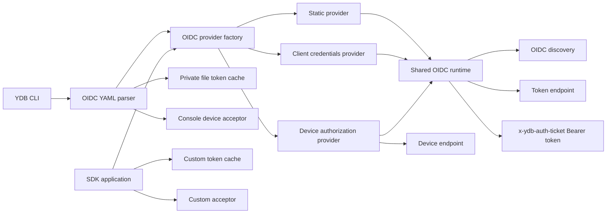

# План поддержки OIDC/OAuth в YDB C++ SDK и CLI

## 1. Цель и границы

Добавить в C++ SDK и основной YDB CLI клиентскую OIDC/OAuth-аутентификацию для трёх сценариев:

1. Static Provider — использование заранее полученных access/refresh tokens.
2. Client Provider — OAuth 2.0 Client Credentials Grant для machine-to-machine доступа.
3. Device Provider — OAuth 2.0 Device Authorization Grant для интерактивного входа пользователя.

Общая реализация должна поддерживать:

- OIDC Discovery по issuer;
- переиспользование и ротацию token set;
- локальный кеш между запусками CLI;
- интерактивный acceptor для Device Authorization Grant;
- единую фабрику, возвращающую существующий [`ICredentialsProviderFactory`](../public/sdk/cpp/include/ydb-cpp-sdk/client/types/credentials/credentials.h:75);
- асинхронную инициализацию через существующий [`ICredentialsProvider::GetAuthInfoAsync()`](../public/sdk/cpp/include/ydb-cpp-sdk/client/types/credentials/credentials.h:20);
- интеграцию с CLI options, profiles, `auth get-token`, help и документацией.

Вне scope:

- SDK других языков;
- server-side проверка JWT и настройка TicketParser;
- Authorization Code Grant;
- автоматическое открытие браузера;
- явный `discovery_endpoint`;
- `client_secret_post`;
- печать access/refresh tokens в CLI.

## 2. Источники и текущее состояние

Использовать как основу:

- `https://wiki.yandex-team.ru/kikimr/developers/security/oidc/flou-autentifikacii-v-ydb-2/`;
- `https://wiki.yandex-team.ru/kikimr/developers/security/oidc/oidcoauth-v-clisdk/`;
- [`docs/ai`](../docs/ai) — выполнен обязательный поиск, релевантных OIDC-материалов не найдено;
- [`public/sdk/cpp/AGENTS.md`](../public/sdk/cpp/AGENTS.md:1) — требования к API, async lifecycle, standalone dependencies, tests и clang-tidy;
- текущие контракты [`ICredentialsProvider`](../public/sdk/cpp/include/ydb-cpp-sdk/client/types/credentials/credentials.h:15) и [`ICredentialsProviderFactory`](../public/sdk/cpp/include/ydb-cpp-sdk/client/types/credentials/credentials.h:75);
- lifecycle pattern из [`TLoginCredentialsProvider`](../public/sdk/cpp/src/client/types/credentials/login/login.cpp:57);
- HTTP/retry/refresh pattern из [`TOauth2TokenExchangeProviderImpl`](../public/sdk/cpp/src/client/types/credentials/oauth2_token_exchange/credentials.cpp:168);
- CLI auth wiring в [`TClientCommandRootCommon::SetCredentialsGetter()`](../public/lib/ydb_cli/commands/ydb_root_common.cpp:327), [`TClientCommandRootCommon::Config()`](../public/lib/ydb_cli/commands/ydb_root_common.cpp:349) и [`TClientCommandRoot::SetCredentialsGetter()`](../apps/ydb/commands/ydb_root.cpp:28);
- profile wiring в [`TCommandProfileCommon::SetupProfileAuthentication()`](../public/lib/ydb_cli/commands/ydb_profile.cpp:530) и [`TCommandProfileCommon::SetAuthFromCommandLine()`](../public/lib/ydb_cli/commands/ydb_profile.cpp:622).

Wiki-код трактовать как архитектурный pseudocode. Не переносить глобальный `once_flag`, блокирующий polling, неоднозначные endpoint names и неполную обработку ошибок.

## 3. Целевая архитектура



Разделение ответственности:

- C++ SDK содержит публичные data contracts, cache/acceptor abstractions, factory и protocol providers.
- CLI читает YAML, создаёт file cache и console acceptor, затем передаёт готовые SDK params в фабрику.
- Core SDK не получает YAML dependency. Это сохраняет standalone SDK boundary и упрощает programmatic API.
- Existing OAuth 2.0 Token Exchange остаётся отдельным RFC 8693 механизмом; новый код не меняет его API или поведение.

## 4. Публичный C++ SDK contract

Создать модуль:

- [`public/sdk/cpp/include/ydb-cpp-sdk/client/types/credentials/oidc/credentials.h`](../public/sdk/cpp/include/ydb-cpp-sdk/client/types/credentials/oidc/credentials.h:1);
- [`public/sdk/cpp/src/client/types/credentials/oidc/credentials.cpp`](../public/sdk/cpp/src/client/types/credentials/oidc/credentials.cpp:1);
- [`public/sdk/cpp/src/client/types/credentials/oidc/ya.make`](../public/sdk/cpp/src/client/types/credentials/oidc/ya.make:1).

Добавить additive API без изменения существующих virtual methods:

- [`TOidcToken`](../public/sdk/cpp/include/ydb-cpp-sdk/client/types/credentials/oidc/credentials.h:1): token value и optional absolute expiry;
- [`TOidcTokenSet`](../public/sdk/cpp/include/ydb-cpp-sdk/client/types/credentials/oidc/credentials.h:1): access token и optional refresh token;
- [`IOidcTokenCache`](../public/sdk/cpp/include/ydb-cpp-sdk/client/types/credentials/oidc/credentials.h:1): `Read()` и `Write()`; отсутствие данных возвращается как empty optional; ошибки чтения/записи возвращаются вызывающему коду, а не скрываются;
- [`TOidcDeviceAuthorizationInfo`](../public/sdk/cpp/include/ydb-cpp-sdk/client/types/credentials/oidc/credentials.h:1): `UserCode`, `VerificationUri`, optional `VerificationUriComplete` и expiry;
- [`IOidcAuthorizationAcceptor`](../public/sdk/cpp/include/ydb-cpp-sdk/client/types/credentials/oidc/credentials.h:1): callback показа device authorization данных;
- [`TStaticOidcCredentials`](../public/sdk/cpp/include/ydb-cpp-sdk/client/types/credentials/oidc/credentials.h:1);
- [`TClientCredentialsGrantParams`](../public/sdk/cpp/include/ydb-cpp-sdk/client/types/credentials/oidc/credentials.h:1);
- [`TDeviceAuthorizationGrantParams`](../public/sdk/cpp/include/ydb-cpp-sdk/client/types/credentials/oidc/credentials.h:1);
- [`TOidcCredentialsParams`](../public/sdk/cpp/include/ydb-cpp-sdk/client/types/credentials/oidc/credentials.h:1): issuer, flow variant, optional cache, socket/connect/sync-init timeouts, refresh skew;
- [`CreateOidcCredentialsProviderFactory()`](../public/sdk/cpp/include/ydb-cpp-sdk/client/types/credentials/oidc/credentials.h:1).

Контракт factory:

- [`CreateProvider(std::weak_ptr<ICoreFacility>)`](../public/sdk/cpp/include/ydb-cpp-sdk/client/types/credentials/credentials.h:81) создаёт provider, привязанный к driver facility.
- [`CreateProvider()`](../public/sdk/cpp/include/ydb-cpp-sdk/client/types/credentials/credentials.h:79) создаёт owning facility wrapper по существующему pattern [`TOwningFacilityCredentialsProvider`](../public/sdk/cpp/include/ydb-cpp-sdk/client/types/credentials/credentials.h:38).
- Никаких process-global `once_flag`; каждый factory безопасно кеширует только свой no-argument provider.
- Client identity не содержит token или client secret. Identity строится из issuer, flow kind, client id и scopes либо возвращается пустой, если безопасная стабильная identity невозможна.

## 5. Protocol semantics

### 5.1 Discovery

- Нормализовать issuer удалением только завершающего `/`.
- Запрашивать `<issuer>/.well-known/openid-configuration`.
- Проверять HTTP status, JSON object, exact `issuer`, обязательный `token_endpoint` и для Device flow обязательный `device_authorization_endpoint`.
- Не поддерживать explicit discovery override.
- Discovery result кешировать в provider instance; повторять запрос только после retryable failure или при создании нового provider.

### 5.2 Token representation

- В YDB запрос передавать `Bearer <access_token>`, что соответствует server-side External IdP path, используемому в [`ExternalIdpAuthenticationOk`](../core/security/ticket_parser_ut.cpp:3805).
- Из token endpoint принимать только case-insensitive `Bearer` token type.
- Expiry вычислять из `expires_in`. Для seed/cache token использовать explicit expiry, затем JWT `exp`; opaque access token без expiry считать usable без background refresh.
- Не использовать ID token как YDB auth ticket.
- При refresh-token rotation атомарно заменять весь token set. Если новый response не содержит refresh token, сохранять предыдущий.

### 5.3 Refresh и retries

- Valid cached access token использовать сразу.
- Refresh запускать до expiry: midpoint оставшегося lifetime с safety skew; не создавать zero-delay busy loop.
- Если access token истёк, а refresh token доступен, initial auth future ждёт refresh.
- Retryable: network errors, timeout, HTTP 408, 429 и 5xx; учитывать `Retry-After`, иначе exponential backoff с jitter и upper bound.
- Non-retryable OAuth errors завершать initial future exception. Во время background refresh сохранять текущий access token до его expiry.
- `invalid_grant` инвалидирует refresh token; Client flow переходит к новому client_credentials grant, Device flow требует нового user interaction.
- Provider teardown отменяет waits/polling, не вызывает self-join, не оставляет unresolved promise и не исполняет user callback под mutex.

### 5.4 Client Credentials Grant

- POST form: `grant_type=client_credentials`, optional space-separated `scope`.
- Client authentication: HTTP Basic only, RFC 6749 section 2.3.1; корректное form encoding до Base64.
- `client_secret_post` отсутствует в API и YAML.

### 5.5 Device Authorization Grant

- Device request: `client_id` и optional `scope` на discovery `device_authorization_endpoint`.
- Проверять `device_code`, `user_code`, `verification_uri`, `expires_in`; `interval` default 5 seconds; сохранять optional `verification_uri_complete`.
- Вызвать acceptor один раз после успешного device response.
- Poll token endpoint до expiry:
  - `authorization_pending` — продолжить с текущим interval;
  - `slow_down` — увеличить interval минимум на 5 seconds;
  - `access_denied` и `expired_token` — terminal error;
  - transport/5xx/429 — bounded retry без нарушения device-code deadline.
- Console acceptor выводит только verification URL и user code. Токены не выводятся.

### 5.6 Static Provider

- Static config задаёт seed access token, optional access expiry, optional refresh token и optional refresh expiry.
- Cache с совпадающей identity имеет приоритет над seed, если содержит более новый usable/refreshable token set. Это сохраняет rotated refresh token между запусками.
- Без access expiry provider не планирует refresh автоматически.
- Если expiry известен и refresh token задан, provider использует standard Refresh Token Grant.
- Issuer остаётся обязательным для discovery при refresh и для cache identity.

## 6. CLI YAML contract

CLI option:

```text
ydb --oidc-config <path> ...
```

Profile representation:

```yaml
authentication:
  method: oidc-config
  data: /path/to/oidc.yaml
```

OIDC config поддерживает ровно один flow block:

```yaml
issuer: https://idp.example/realms/ydb
cache_path: /home/user/.cache/ydb/oidc-token.json

client_credentials_grant:
  client_id: ydb-service
  client_secret: secret
  scope:
    - openid
    - ydb
```

```yaml
issuer: https://idp.example/realms/ydb
cache_path: /home/user/.cache/ydb/oidc-token.json

device_authorization_grant:
  client_id: ydb-cli
  scope:
    - openid
    - ydb
```

```yaml
issuer: https://idp.example/realms/ydb
cache_path: /home/user/.cache/ydb/oidc-token.json

static_credentials:
  access_token: token
  access_token_expires_at: 2026-08-18T07:00:00Z
  refresh_token: refresh-token
  refresh_token_expires_at: 2026-08-19T07:00:00Z
```

Validation:

- unknown fields, duplicate flow blocks, missing issuer/client id/secret/token и malformed timestamps — misuse error before driver creation;
- scopes — non-empty strings;
- relative `cache_path` разрешать относительно OIDC config directory, а не current working directory;
- client secret не включать в exception, verbose connection params или client identity;
- config file с group/other readability на Unix отклонять с понятной security error, поскольку он может содержать client secret или static tokens.

## 7. CLI integration

Обновить:

- [`TClientSettings`](../public/lib/ydb_cli/commands/ydb_root_common.h:26): capability flag `UseOidcAuth`;
- [`TClientCommand::TConfig`](../public/lib/ydb_cli/common/command.h:80): OIDC config path/params;
- [`TClientCommandRootCommon::Config()`](../public/lib/ydb_cli/commands/ydb_root_common.cpp:349): `--oidc-config`, profile method `oidc-config`, auth exclusivity и help;
- [`TClientCommandRootCommon::SetCredentialsGetter()`](../public/lib/ydb_cli/commands/ydb_root_common.cpp:327) и [`TClientCommandRoot::SetCredentialsGetter()`](../apps/ydb/commands/ydb_root.cpp:28): factory creation;
- [`TCommandProfileCommon`](../public/lib/ydb_cli/commands/ydb_profile.h:28) и [`TCommandProfileCommon::Config()`](../public/lib/ydb_cli/commands/ydb_profile.cpp:708): create/update/replace/stdin support;
- [`NewYdbClient()`](../apps/ydb/commands/ydb_root.cpp:99): enable capability for main CLI;
- other root constructors that instantiate [`TClientSettings`](../public/lib/ydb_cli/commands/ydb_root_common.h:26): explicitly disable capability where OIDC is out of scope, preserving build behavior.

Добавить CLI-owned helpers:

- [`public/lib/ydb_cli/common/oidc_config.h`](../public/lib/ydb_cli/common/oidc_config.h:1);
- [`public/lib/ydb_cli/common/oidc_config.cpp`](../public/lib/ydb_cli/common/oidc_config.cpp:1);
- [`public/lib/ydb_cli/common/oidc_file_token_cache.h`](../public/lib/ydb_cli/common/oidc_file_token_cache.h:1);
- [`public/lib/ydb_cli/common/oidc_file_token_cache.cpp`](../public/lib/ydb_cli/common/oidc_file_token_cache.cpp:1).

File cache requirements:

- versioned JSON payload;
- bind data to normalized issuer, flow kind, client id и scopes; client secret не сохранять;
- read corruption/mismatch как cache miss с diagnostic, но permission violation как hard failure;
- owner-only directory/file permissions; file mode `0600` on Unix;
- unique temp file, flush/close, atomic rename, cleanup temp on failure;
- in-process mutex for concurrent provider callbacks; межпроцессная блокировка в первой версии не требуется.

## 8. SDK implementation sequence

1. Добавить public types, validation и additive factory declaration.
2. Добавить private URL/form/JSON helpers и strict discovery parser.
3. Реализовать shared provider state machine: cache bootstrap, initial promise, access token publication, refresh scheduling, retries, cancellation и teardown.
4. Реализовать Refresh Token Grant shared path.
5. Реализовать Static flow.
6. Реализовать Client Credentials flow с Basic auth.
7. Реализовать Device flow и RFC 8628 polling.
8. Подключить module в [`public/sdk/cpp/src/client/types/credentials/ya.make`](../public/sdk/cpp/src/client/types/credentials/ya.make:1) и standalone dependency checks.
9. Не рефакторить существующий token-exchange provider без необходимости; reusable code выделять только если это не расширяет diff и сохраняет его tests.

## 9. Tests

### 9.1 C++ SDK unit tests

Добавить [`public/sdk/cpp/tests/unit/client/oidc`](../public/sdk/cpp/tests/unit/client/oidc):

- params validation и factory lifecycle;
- discovery URL normalization, issuer mismatch, missing/wrong fields, malformed JSON;
- Client Credentials request body, Basic auth encoding, scopes, response parsing;
- cache hit, cache miss, stale access with refresh, rotated refresh token, cache errors;
- static opaque token, static JWT expiry, explicit expiry precedence;
- refresh midpoint/skew и retry behavior без sleeps через controllable clock/scheduler abstractions;
- Device success, default/custom interval, `authorization_pending`, `slow_down`, denial, expiry, cancellation;
- transport errors, 408/429/5xx, `Retry-After`, non-retryable 4xx;
- facility expiration, provider destruction, exactly-once promise completion, no deadlock/self-join;
- no secret/token content in errors.

Переиспользовать deterministic HTTP server approach из [`public/sdk/cpp/tests/unit/client/oauth2_token_exchange/helpers`](../public/sdk/cpp/tests/unit/client/oauth2_token_exchange/helpers), но создать OIDC-specific scripted server с captured requests.

### 9.2 CLI tests

Обновить [`apps/ydb/ut/parse_command_line.cpp`](../apps/ydb/ut/parse_command_line.cpp:1):

- explicit `--oidc-config` selection;
- active/explicit profile selection;
- mutual exclusion и precedence относительно token, login, IAM и token exchange;
- malformed/missing config diagnostics;
- connection verbose output не раскрывает secrets.

Обновить [`tests/functional/ydb_cli/test_ydb_profile.py`](../tests/functional/ydb_cli/test_ydb_profile.py:1):

- create/update/replace/get profile with `oidc-config`;
- stdin profile creation;
- removal/replacement by another auth method;
- path persistence without embedding OIDC secrets in YDB profile.

Добавить focused cache tests для permissions, atomic replacement, corrupt JSON и relative path resolution.

### 9.3 Integration smoke

Если repository test infrastructure позволяет поднять scripted IdP и external IdP-enabled YDB без flaky browser interaction, добавить smoke test для Client Credentials и cached Device token. Иначе ограничить scope deterministic provider/CLI unit tests и отдельно зафиксировать manual Keycloak scenario.

## 10. Documentation and examples

Обновить:

- [`docs/en/core/reference/ydb-cli/_includes/auth`](../docs/en/core/reference/ydb-cli/_includes/auth) и [`docs/ru/core/reference/ydb-cli/_includes/auth`](../docs/ru/core/reference/ydb-cli/_includes/auth): option, profile method, config schema и security notes;
- [`docs/en/core/reference/ydb-sdk/_includes/auth.md`](../docs/en/core/reference/ydb-sdk/_includes/auth.md:1) и [`docs/ru/core/reference/ydb-sdk/_includes/auth.md`](../docs/ru/core/reference/ydb-sdk/_includes/auth.md:1): C++ programmatic API;
- [`public/sdk/cpp/examples/auth`](../public/sdk/cpp/examples/auth): minimal Client Credentials и Device examples, без real secrets;
- [`public/sdk/cpp/CHANGELOG.md`](../public/sdk/cpp/CHANGELOG.md:1) и [`apps/ydb/CHANGELOG.md`](../apps/ydb/CHANGELOG.md:1).

Документация должна явно сказать:

- cache содержит bearer credentials и должен быть защищён;
- CLI не печатает tokens;
- Device flow показывает URL/code и ждёт завершения входа;
- issuer должен совпадать с discovery response;
- поддерживается только `client_secret_basic`;
- static opaque token без expiry не обновляется автоматически.

## 11. Verification

Последовательность проверки после implementation:

1. Форматировать только изменённые C++ files через repository style tool.
2. Собрать OIDC production module и unit test target с warnings-as-errors.
3. Запустить OIDC SDK tests.
4. Собрать и запустить CLI command-line/profile unit tests.
5. Запустить relevant functional profile tests.
6. Собрать основной [`apps/ydb`](../apps/ydb) target.
7. Запустить [`public/sdk/cpp/scripts/check_peerdirs.py`](../public/sdk/cpp/scripts/check_peerdirs.py:1).
8. Сгенерировать focused compile commands и запустить production clang-tidy по изменённым translation units согласно [`public/sdk/cpp/AGENTS.md`](../public/sdk/cpp/AGENTS.md:52).
9. Проверить final diff: только OIDC SDK/CLI/docs/tests/build files, без tokens, generated artifacts и unrelated formatting.

## 12. Acceptance criteria

- Все три flows создаются через единую public factory и работают с существующим YDB driver.
- First request ждёт initial token asynchronously и не отправляется с пустым auth ticket.
- Access token передаётся как `Bearer` ticket.
- Client Credentials использует discovery token endpoint и Basic client authentication.
- Device flow корректно обрабатывает RFC 8628 polling states и cancellation.
- Refresh token и access token переиспользуются между CLI launches через private atomic cache.
- Rotated refresh token не теряется при normal restart.
- CLI profile хранит только путь к OIDC config, не копирует secrets.
- Ни errors, ни verbose logs, ни console acceptor не раскрывают tokens/client secret.
- Existing auth methods и OAuth 2.0 Token Exchange сохраняют текущее поведение.
- Focused tests, main CLI build, SDK dependency check и clang-tidy проходят.
