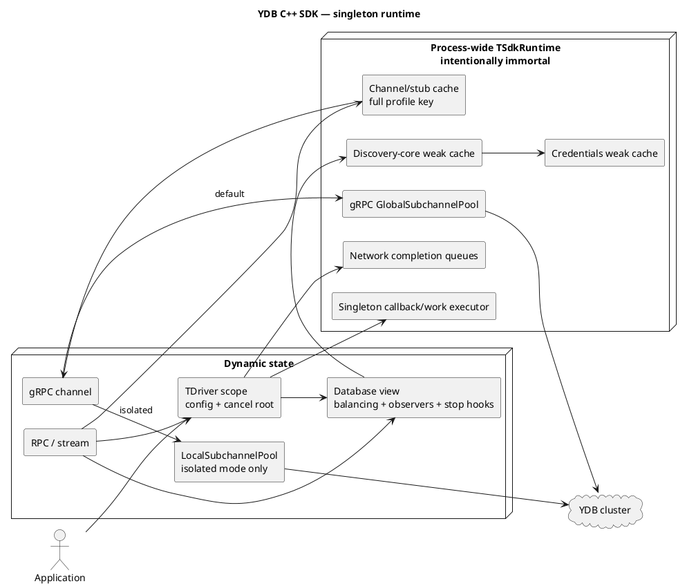

# YDBAPPTEAM-1490: process-wide C++ SDK runtime

Status: draft

## Proposal

Make the runtime a process singleton, not `TDriver` itself.

- `TSdkRuntime` is created once and intentionally never destroyed.
- `TDriver` becomes a cheap configuration and cancellation handle.
- Drivers share network threads, the callback executor, channels, discovery work, and safe credentials providers.
- Driver-specific behavior remains isolated.



## Ownership

| Object | Owns |
|---|---|
| `TSdkRuntime` | Network CQs/workers, the one executor, scheduler, process caches |
| Driver scope | Immutable config, cancellation root, callback limits, extensions and observability |
| Database core | Raw discovery result, refresh loop, shareable credentials |
| Database view | Balancing, endpoint health, mutator, metrics/logging/tracing and stop hooks |
| Request | Driver cancellation child, database view and channel reference |

The current `TDbDriverState` cannot be cached globally as-is: it contains a raw driver pointer, driver stop callbacks, balancing, logging and metrics. Split it into the shared core and per-driver view above.

## One executor

There is exactly one core SDK callback/work executor per process.

- Remove `TDriverConfig::SetExecutor()` from the new source API.
- Configure an optional custom executor only before the first SDK object.
- The runtime starts it once, owns it for process lifetime, and never stops it from `TDriver::Stop()`.
- Every application-visible core callback, including stream callbacks currently invoked on CQ threads, must eventually pass through this executor.
- Per-driver “lanes” may limit concurrency or queue size, but cannot choose another executor.

Use a typestate builder so setting the executor twice on one configuration does not compile:

```cpp
auto config = TSdkRuntimeConfig{}
    .WithExecutor(executor); // returns a type without WithExecutor()

InitializeSdkRuntime(std::move(config));
```

`TDriverConfig` has no executor member, so passing a second executor through another driver is impossible in new source.

C++ cannot prove uniqueness across separate translation units or separately created config objects. `InitializeSdkRuntime()` must therefore also reject a second bootstrap attempt at runtime. If compile/link-time uniqueness across the whole binary is mandatory, either disallow custom executor injection entirely or use one application-defined ODR bootstrap symbol.

## Sharing rules

### Database state

Share only the heavy core:

- raw ListEndpoints result and refresh;
- built-in credentials providers explicitly marked process-shareable;
- runtime-owned scheduling facility.

Keep these in the driver view:

- sync/async/off waiting behavior;
- balancing and endpoint pessimization;
- discovery mutator;
- metrics, logs and traces;
- queued-request limit;
- client/session stop callbacks.

Custom credentials factories are driver-scoped by default. `GetClientIdentity()` alone is not proof that a provider is safe to share across runtime facilities.

### Channels and transports

The process channel cache must not remain keyed only by endpoint. Its key includes the complete transport profile:

- endpoint and TLS identity;
- SSL target override;
- message limits, compression and gRPC load-balancing policy;
- gRPC and TCP keepalive;
- TCP_NODELAY;
- local/global subchannel mode;
- resource-quota domain.

Behavior:

| Mode | Sharing |
|---|---|
| Default, identical full profile | Share channel and gRPC global subchannel |
| Any profile field differs | Use a different SDK channel |
| `SetUsePerChannelTcpConnection(true)` | Include driver id in the key and use `LocalSubchannelPool` |
| Non-zero gRPC memory quota | Initially include driver id to preserve quota isolation |

Endpoint removal updates only that database view. It must not globally delete a channel that another driver may still use.

## Settings

| Existing setting | New meaning |
|---|---|
| Network thread count | Process minimum hint; runtime grows to the maximum requested value and never shrinks |
| Client thread count | Maximum callback concurrency for that driver's lane |
| Client queue size | Backpressure for that driver's lane |
| `SetExecutor` | Deleted; executor belongs to runtime bootstrap |
| Database, endpoint, credentials, discovery mode | Driver defaults, still overridable by client settings |
| Balancing, queued requests, drain-on-dtor | Driver/database-view scoped |
| TLS, keepalive, compression, message sizes | Exact channel-profile fields |
| Log, metrics, tracing, extensions | Driver/view scoped; never first-driver-wins |
| Topic default executors | Use runtime lanes; explicit codec/handler executors remain a separate API policy |

No behavioral setting uses “first driver wins”.

## Construction and stop

Driver and client constructors do not wait for discovery. `EDiscoveryMode::Sync` waits at the first operation boundary instead.

`TDriver::Stop()` stops one logical driver:

```text
Active -> Quiescing -> Cancelling -> Draining -> Stopped
```

1. Reject new public work.
2. Run that driver's stop hooks.
3. Cancel its root context and child RPCs/streams/timers.
4. Detach its database views and private channel/provider leases.
5. `Stop(true)` waits only for that driver's operations and callbacks.

The process runtime, network threads and singleton executor keep running. Stop initiated inside a callback is finalized on the runtime control lane after the callback returns; no detached teardown thread is needed.

## Intentional compatibility changes

- `TDriverConfig::SetExecutor()` is removed.
- Driver/client construction no longer blocks on synchronous discovery.
- Network thread count becomes a process capacity hint, not per-driver ownership.
- All core callbacks ultimately use the singleton executor.

Everything else keeps source-level behavior through driver views, logical callback lanes, exact channel profiles, and isolated local/quota transport domains.

## Implementation order

1. Introduce immortal `TSdkRuntime`, one-shot executor bootstrap, and per-driver cancellation roots.
2. Route all core callbacks through the singleton executor; preserve per-driver concurrency and queue limits with logical lanes.
3. Move the channel cache to the runtime and key it by the full transport profile.
4. Split database core from driver view, then move discovery and safe credentials caching to the runtime.
5. Move default topic work to runtime lanes.
6. Delete per-driver CQs, worker joins, default response pools, channel expiry tasks, detached teardown threads and driver-wide state scans.

## Required checks

- Creating many drivers does not increase default SDK thread count.
- Stopping driver A does not affect driver B while they share runtime, discovery, credentials or channels.
- Identical channel profiles share; every differing profile field isolates.
- Local-subchannel drivers never share transports with each other.
- One-driver callback concurrency and queue limits still work on the shared executor.
- A second runtime executor bootstrap fails before starting or publishing its executor.
- Stop from unary, stream and user callbacks cannot deadlock.
- Static driver destruction and concurrent cache expiry are TSAN-clean.

## Existing defects to fix separately

- `TChannelPool` is currently keyed only by endpoint, so different TLS/channel settings can reuse the first channel.
- `SetMaxClientQueueSize()` stores `MaxQueuedResponses_`, but executor construction uses `MaxQueuedRequests_`; the documented callback limit is not applied.
