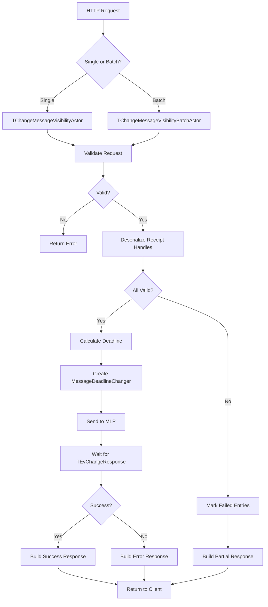

# ChangeMessageVisibility Implementation Plan

## Overview
Implement `ChangeMessageVisibility` and `ChangeMessageVisibilityBatch` methods for the AWS SQS API in the YDB SQS Topic service.

## Architecture Analysis

### Key Components Identified

1. **MLP (Message Lifecycle Protocol) API**:
   - `CreateMessageDeadlineChanger` - Changes visibility timeout by setting a new deadline
   - `TMessageDeadlineChangerSettings` - Configuration for deadline changes
   - `TEvChangeResponse` - Response event (same as DeleteMessage)

2. **Reference Implementation**: [`delete_message.cpp`](delete_message.cpp)
   - Uses `TDeleteMessageActorBase` template pattern
   - Handles both single and batch operations
   - Uses `CreateCommitter` for message deletion

3. **Pattern to Follow**:
   ```
   TChangeMessageVisibilityActorBase (template base class)
   ├── TChangeMessageVisibilityActor (single message)
   └── TChangeMessageVisibilityBatchActor (batch operations)
   ```

## Key Differences from DeleteMessage

| Aspect | DeleteMessage | ChangeMessageVisibility |
|--------|---------------|-------------------------|
| MLP Component | `CreateCommitter` | `CreateMessageDeadlineChanger` |
| Settings Type | `TCommitterSettings` | `TMessageDeadlineChangerSettings` |
| Input Parameter | `receipt_handle` | `receipt_handle` + `visibility_timeout` |
| Operation | Commits (deletes) messages | Changes visibility deadline |
| Deadline Calculation | N/A | `TInstant::Now() + TDuration::Seconds(visibility_timeout)` |

## Implementation Structure

### 1. Header File: `change_message_visibility.h`
```cpp
#pragma once

#include <ydb/core/grpc_services/base/base.h>
#include <ydb/library/actors/core/actor.h>
#include <memory>

namespace NKikimr::NSqsTopic::V1 {
    std::unique_ptr<NActors::IActor> CreateChangeMessageVisibilityActor(
        NKikimr::NGRpcService::IRequestOpCtx* msg);
    std::unique_ptr<NActors::IActor> CreateChangeMessageVisibilityBatchActor(
        NKikimr::NGRpcService::IRequestOpCtx* msg);
}
```

### 2. Implementation File: `change_message_visibility.cpp`

#### Class Hierarchy:
```
TChangeMessageVisibilityActorBase<TDerived, TServiceRequest>
  - Inherits from: TQueueUrlHolder, TGrpcActorBase
  - Template parameters: TDerived (CRTP), TServiceRequest
  - Key methods:
    * Bootstrap() - Validates request, extracts entries
    * Handle(TEvChangeResponse) - Processes MLP response
    * StateWork() - Event handler
```

#### Key Implementation Details:

1. **Entry Extraction**:
   - Single: Extract `receipt_handle` and `visibility_timeout` from request
   - Batch: Extract array of entries with `id`, `receipt_handle`, `visibility_timeout`

2. **Validation**:
   - Queue URL validation
   - Batch size limits (1-10 entries)
   - Unique entry IDs
   - Valid receipt handles
   - Visibility timeout range (0-43200 seconds per AWS SQS spec)

3. **MLP Integration**:
   ```cpp
   NPQ::NMLP::TMessageDeadlineChangerSettings changerSettings{
       .DatabasePath = QueueUrl_->Database,
       .TopicName = FullTopicPath_,
       .Consumer = QueueUrl_->Consumer,
       .Messages = std::move(requestList),
       .Deadline = TInstant::Now() + TDuration::Seconds(visibilityTimeout),
       .UserToken = MakeIntrusive<NACLib::TUserToken>(serializedToken),
   };

   std::unique_ptr<IActor> actorPtr{
       NKikimr::NPQ::NMLP::CreateMessageDeadlineChanger(
           this->SelfId(),
           std::move(changerSettings))
   };
   ```

4. **Response Handling**:
   - Success: Return `ChangeMessageVisibilityResult` (empty for single, entries for batch)
   - Failure: Map errors to SQS error codes
   - Batch: Separate successful and failed entries

### 3. Proto Message Structure

Based on AWS SQS API:

**Single Request**:
```protobuf
message ChangeMessageVisibilityRequest {
    string queue_url = 1;
    string receipt_handle = 2;
    int32 visibility_timeout = 3;
}
```

**Batch Request**:
```protobuf
message ChangeMessageVisibilityBatchRequest {
    string queue_url = 1;
    repeated ChangeMessageVisibilityBatchRequestEntry entries = 2;
}

message ChangeMessageVisibilityBatchRequestEntry {
    string id = 1;
    string receipt_handle = 2;
    int32 visibility_timeout = 3;
}
```

### 4. HTTP Request Registration

In [`http_req.cpp`](../../core/http_proxy/http_req.cpp) (lines 1511-1512):
```cpp
DECLARE_SQS_TOPIC_PROCESSOR_QUEUE_KNOWN(ChangeMessageVisibility);
DECLARE_SQS_TOPIC_PROCESSOR_QUEUE_KNOWN(ChangeMessageVisibilityBatch);
```

### 5. Build Configuration

In [`ya.make`](ya.make), add to SRCS section:
```
change_message_visibility.cpp
```

## Implementation Steps

1. ✅ **Analysis Phase** - Understand DeleteMessage pattern and MLP API
2. **Create Header** - Define actor factory functions
3. **Implement Base Actor** - Template class with common logic
4. **Implement Single Actor** - Handle single message visibility change
5. **Implement Batch Actor** - Handle batch visibility changes
6. **Update Build** - Add to ya.make
7. **Register HTTP Handlers** - Add declarations in http_req.cpp
8. **Testing** - Verify against DeleteMessage patterns

## Error Handling

### SQS Error Codes to Handle:
- `MISSING_PARAMETER` - Missing queue_url or receipt_handle
- `INVALID_PARAMETER_VALUE` - Invalid queue URL or receipt handle
- `RECEIPT_HANDLE_IS_INVALID` - Cannot deserialize receipt
- `EMPTY_BATCH_REQUEST` - Batch size < 1
- `TOO_MANY_ENTRIES_IN_BATCH_REQUEST` - Batch size > 10
- `BATCH_ENTRY_IDS_NOT_DISTINCT` - Duplicate entry IDs
- `INVALID_PARAMETER_COMBINATION` - Duplicate receipts in batch
- `NON_EXISTENT_QUEUE` - Queue doesn't exist
- `INTERNAL_FAILURE` - Internal errors

### Visibility Timeout Validation:
- Range: 0 to 43200 seconds (12 hours)
- Default: 30 seconds (if not specified)
- Error if out of range: `INVALID_PARAMETER_VALUE`

## Metrics

Following the DeleteMessage pattern, emit metrics for:
- Request count: `api.sqs.request.count`
- Response count: `api.sqs.response.count`
- Success/failure breakdown
- Message count (request and response)

## Code Reuse Strategy

Maximum code reuse from [`delete_message.cpp`](delete_message.cpp):
- Copy `TDeleteMessageActorBase` → `TChangeMessageVisibilityActorBase`
- Modify MLP component: `CreateCommitter` → `CreateMessageDeadlineChanger`
- Add visibility timeout extraction and deadline calculation
- Update method names and result types

## Testing Considerations

### Unit Test Implementation
Comprehensive unit tests will be added to `/ydb/core/http_proxy/ut/sqs_topic_ut.cpp`.

**See [UNIT_TEST_PLAN.md](UNIT_TEST_PLAN.md) for detailed test specifications** including:
- 7 comprehensive test cases covering all scenarios
- Error handling validation (10+ error cases)
- Functional behavior verification
- Edge case coverage (timeout=0, timeout=43200)
- Batch operation testing with mixed results

#### Test Categories

**Single Message Tests:**
1. `TestChangeMessageVisibilityInvalid` - Parameter validation and error cases
2. `TestChangeMessageVisibilityBasic` - Basic timeout change functionality
3. `TestChangeMessageVisibilityZeroTimeout` - Immediate message availability
4. `TestChangeMessageVisibilityExtendTimeout` - Timeout extension behavior

**Batch Operation Tests:**
5. `TestChangeMessageVisibilityBatchInvalid` - Batch validation (empty, too many entries)
6. `TestChangeMessageVisibilityBatch` - Mixed success/failure scenarios
7. `TestChangeMessageVisibilityBatchMixedTimeouts` - Different timeouts per message

#### Test Infrastructure
- Uses existing `THttpProxyTestMockForSQSTopic` fixture
- Helper methods already available in `datastreams_fixture.h`:
  - `ChangeMessageVisibility(request, expectedHttpCode)` (line 206)
  - `ChangeMessageVisibilityBatch(request, expectedHttpCode)` (line 210)

#### Integration Test Scenarios
1. Change visibility, verify message doesn't reappear until timeout expires
2. Change visibility to 0, verify immediate re-availability
3. Extend visibility timeout, verify original timeout is overridden
4. Multiple visibility changes on same message

## AWS SQS Compatibility

Ensure compatibility with AWS SQS ChangeMessageVisibility API:
- Visibility timeout range: 0-43200 seconds
- Batch size: 1-10 entries
- Receipt handle format (base64 encoded)
- Error codes match AWS SQS errors

## Mermaid Diagram: Request Flow



## Summary

This implementation follows the established pattern from DeleteMessage but uses the `CreateMessageDeadlineChanger` MLP component to change message visibility timeouts instead of deleting messages. The key difference is calculating a new deadline based on the visibility timeout parameter and using the appropriate MLP actor.

The implementation maintains consistency with the existing codebase architecture, error handling patterns, and metrics reporting while providing full AWS SQS API compatibility for the ChangeMessageVisibility operations.
