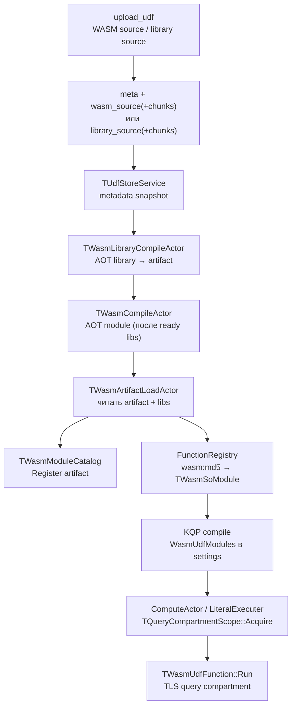

# WASM UDF Runtime — архитектура

## 1. Цель дизайна

WASM UDF живут в UDF Store и исполняются через WAVM:

1. **Исходники** (`.wasm` / `.wat`) и **манифест** хранятся в системных таблицах.
2. **AOT-компиляция** (WAVM object code) пишется в per-CPU artifact-таблицы.
3. **FunctionRegistry** видит модуль как обычный UDF (`ModuleName::Func`), без живого shared compartment.
4. На **каждый запрос / task** строится **отдельный compartment**: линкуются sdk + libraries + нужные UDF-модули; память и состояние не шарятся между запросами.

Ключевой сдвиг относительно «одного живого compartment на процесс»:  
**каталог артефактов — process-wide, compartment — per-query.**

---

## 2. Высокоуровневый поток



---

## 3. Хранение

Префикс: `.metadata/udf_store` (см. `metadata_subscription/storage_paths.*`).

| Таблица | Назначение |
|---|---|
| `meta` | UDF-метаданные: md5, name, type=`WASM`, manifest (JSON), version, compile_status |
| `wasm_source` + `wasm_source_chunks` | тело исходника модуля (chunked blob) |
| `library_source` + `library_source_chunks` | исходники библиотек (ключ = **имя** библиотеки) |
| `artifact_<cpu_spec>` + chunks | AOT: wasm_data + object_code для module **или** library |

`cpu_spec` — нормализованный triple/cpu узла (`DetectLocalCpuSpec` / `WasmCpuSpecOverride`), чтобы object code был валиден на данной машине.

Upload helper: `ydb/tests/functional/udf_store/upload_udf`  
(`--kind udf|library`, для library нужен `--library-name`).

---

## 4. Манифест модуля

JSON, парсится `wasm/manifest.*` → `TWasmManifest`:

```json
{
  "module_name": "WithHelpers",
  "calling_convention": "unversioned_value",
  "module_extension": "wasm",
  "required_libraries": ["sdk", "helpers"],
  "functions": [
    {
      "name": "scale",
      "argument_types": [{"value": "int64", "tag": "concrete_type"}],
      "result_type": {"value": "int64", "tag": "concrete_type"}
    }
  ]
}
```

Важные поля:

- **`module_name`** — имя в YQL (`WithHelpers::scale`).
- **`module_extension`** — `wasm` | `wat` | `wast` → формат исходника / artifact.
- **`required_libraries`** — **упорядоченный** список имён из `library_source`.
  - **Первая** библиотека ставится как runtime via `AddSdk` / `CreateImageFromSdk` → модуль линкуется как **`"env"`**.
  - Остальные — `AddPrecompiledModule(..., name)` под своим именем (например `"helpers"`).
- **`functions`** — plain экспорты и типы ABI (`unversioned_value`).
- **`objects`** — stateful UDF с TypeConfig (ParseTskv-style). Разворачиваются в `functions` с `yql_binding=type_config_callable` (create/call/destroy exports). Реестр объектов — **static** `object_framework`, не отдельный wasm в `required_libraries`.

Пустой `required_libraries` → compartment из `CreateEmptyImage()` (standard host intrinsics: `AllocateBytes`, `ThrowException`).  
Если нужны `malloc`/`free` без пользовательского sdk — это отдельная тема (см. pitfalls).

### Objects / TypeConfigCallable

```json
{
  "module_name": "Prefix",
  "required_libraries": ["sdk"],
  "objects": [
    {
      "name": "Prefix",
      "create_export": "prefix_create",
      "destroy_export": "prefix_destroy",
      "methods": [{
        "name": "Apply",
        "export": "prefix_apply",
        "yql_binding": "type_config_callable",
        "argument_types": [{"value": "string", "tag": "concrete_type"}],
        "result_type": {"value": "string", "tag": "concrete_type"}
      }]
    }
  ]
}
```

YQL UX (opaque TypeConfig blob — host не парсит):

```sql
$fn = YQL::Udf(AsAtom("Prefix.Apply"), Void(), Void(), AsAtom("pre-"));
SELECT $fn("x");  -- "pre-x"
```

Host path (`TWasmConfiguredCallable`):

1. На первом `Run` (и после смены compartment generation): pin config blob через `compartment->AllocateBytes` + `memcpy`, вызвать `create_export(config)` → **ui64 handle**.
2. Каждый `Run`: `call_export(handle, args…)`.
3. Handle валиден только в текущем query compartment; при новом Acquire — recreate.

Статическая библиотека: `wasm/object_framework/` (`ObjectFrameworkCreate/Get/Destroy`). Модуль линкует через `PEERDIR`, не upload’ит framework.wasm.

Имена методов становятся YQL-именами функций (`Prefix::Apply`) и должны быть уникальны в манифесте.

---

## 5. AOT-компиляция

### Библиотека — `TWasmLibraryCompileActor`

1. Читает `library_source` + chunks.
2. `CompileModuleObjectCode(body, format)` (`wasm/compile.cpp`, WAVM `compileModule` → object code).
3. Пишет artifact (`kind=library`, id = library name): wasm_data + object_code chunks.
4. `compile_status = ready|failed` в `library_source`.

### Модуль — `TWasmCompileActor`

1. Не стартует, пока `AreLibraryDependenciesReady(manifest)` (все `required_libraries` в snapshot со статусом `ready`).
2. Проверяет, что artifact’ы библиотек существуют.
3. Валидирует экспорты (`CollectWasmExports` vs plain `functions[].name` и create/call/destroy для `objects`).
4. Компилирует user module → artifact (`kind=module`, id = md5).
5. Обновляет `meta.compile_status`.

При смене/удалении библиотеки сервис может выгрузить зависящие WASM UDF и перезапустить compile (`UnloadWasmUdfsDependingOnLibrary`, `RetryPendingWasmCompilesForLibrary`).

---

## 6. Загрузка в процесс — `TWasmArtifactLoadActor`

После `compile_status=ready`:

1. Читает module artifact (wasm_data + object_code).
2. По порядку `required_libraries` читает library artifacts → `TVector<TNamedModuleBytecode>`.
3. `LoadWasmFromManifest` / `BuildModuleStateFromManifest`:
   - кладёт `TWasmModuleArtifact` в **`TWasmModuleCatalog`** (md5 + module_name → bytecode + libraries);
   - строит `TWasmSoModule` / `TWasmUdfFunction` и регистрирует в FunctionRegistry по пути `wasm:<md5>` с именем `module_name`.

На этом этапе **живой compartment для исполнения не создаётся** — только метаданные и object code в каталоге.

---

## 7. Module catalog vs per-query compartment

### `TWasmModuleCatalog` (process-wide)

- Хранит immutable-артефакты: манифест, module bytecode, список library bytecodes.
- Индексы: by md5, by module name.
- Потокобезопасный mutex.

### `TWasmCompartmentManager::Acquire(moduleNames)`

На каждый запрос (точнее — на scope в CA / literal executer):

1. `EnsureUdfHostIntrinsicsRegistered()` — host ABI в WAVM standard intrinsics.
2. `Catalog.ResolveModules(moduleNames)`.
3. Собирает уникальные libraries в порядке `RequiredLibraries` (первая — sdk/env).
4. `CreateRegistryCompartment(libraries)`:
   - `libraries.empty()` → `CreateEmptyImage()`;
   - иначе → `CreateImageFromSdk(first)` + `AddPrecompiledModule` для остальных.
5. Для каждого артефакта: `AddPrecompiledModule(moduleBytecode, moduleName)`.
6. Резолвит экспорты в map `"ModuleName::Export" → void*` (`MakeExportKey`) — для plain это YQL-имя, для objects — create/call/destroy.
7. Выставляет `Generation` (monotonic) на handle — TypeConfig callable пересоздаёт объекты при смене generation.

Результат — `TQueryCompartmentHandle` (compartment + Exports + Generation). Владелец — `TQueryCompartmentScope`.

### TLS

Два уровня «текущего» указателя:

| TLS | Назначение |
|---|---|
| `TCurrentQueryCompartmentGuard` / `GetCurrentQueryCompartment()` | query handle с Exports (нужен `TWasmUdfFunction::Run`) |
| `TCurrentCompartmentGuard` / `GetCurrentCompartment()` (NYdb::NWasm) | WAVM compartment для PtrFromVM / host ThrowException |

`TQueryCompartmentScope::Activate()` ставит query TLS; внутри `Run` дополнительно ставится NYdb compartment guard.

---

## 8. Связка с KQP

1. **Compile / predictor** (`kqp_predictor`): обходит план, на `TCoUdf` собирает имена модулей в `WasmUdfModules`.
2. Модули попадают в `TProgram::TSettings` задачи.
3. **Compute actor** (`kqp_pure_compute_actor`, `kqp_scan_compute_actor`) и **literal executer**:
   - в bootstrap: `TQueryCompartmentScope(settings)` → `Acquire`;
   - на выполнение событий / DoExecute: `Activate()` → TLS guard;
   - при ошибке Acquire — `ErrorFromIssue` / failure state **до** `SetTaskRunner`.
4. Исполнение UDF → `TWasmUdfFunction::Run` или `TWasmConfiguredCallable::Run` читает TLS query compartment и вызывает export.

Ошибка Acquire до появления task stats раньше маскировалась `AFL_ENSURE(stats.GetTasks().size() == 1)` в `kqp_executer_stats.cpp`; пустые Tasks при early failure теперь пропускаются, чтобы клиент видел исходный issue.

---

## 9. Host ABI и calling convention

Файлы: `wasm/host.*`, `wasm/abi/udf_cpp_abi.h`.

Зарегистрированы на **standard** intrinsic module (`getIntrinsicModule_standard()`):

- `AllocateBytes(context, size)` — аллокация через `TWasmUdfInvocationContext::WebAssemblyPool` (не через wasm `malloc`, когда вызывается host intrinsic).
- `ThrowException(const char*)` — `THROW_ERROR_EXCEPTION` с текстом из wasm memory (`PtrFromVM` + `GetCurrentCompartment()`).

`compartment->AllocateBytes` (engine) идёт через **экспорт `malloc` у RuntimeLibraryInstance_** (sdk / AddSdk). Поэтому:

- с пользовательским `sdk` в `required_libraries[0]` нужны рабочие `malloc`/`free` в этом sdk;
- stub sdk для тестов обязан экспортировать bump-`malloc` (см. `data/wasm/sdk_stub.wat`).

Calling convention `unversioned_value`: указатели на `TUnversionedValue` в wasm memory; типы int64/uint64/double/bool/string/null.

Ошибки из wasm: `ThrowException` → C++ exception → `WasmError` → `UdfTerminate("name(); ex: …")`.

---

## 10. Линковка модулей (WAVM)

`ydb/library/wasm/engine/compartment.cpp`:

- `CreateEmptyImage` — standard intrinsics как `"env"` (+ host после `EnsureUdfHostIntrinsicsRegistered`).
- `CreateImageFromSdk` — Empty + `AddSdk` (кэш `TSdkImageCache`); sdk instance = RuntimeLibraryInstance.
- `AddPrecompiledModule(bytecode, name)`:
  - требует **ObjectCode**;
  - IR: Binary → `loadBinaryModule(Data)`, HumanReadable (wat) → `ParseWast(Data)`;
  - instantiate под именем `name` (`"env"` для sdk, `"helpers"` для библиотеки, `ModuleName` для UDF).
- Импорты UDF вида `(import "helpers" "helpers_scale" …)` резолвятся в предыдущие instance’ы.

Порядок в compartment при `required_libraries: ["sdk", "helpers"]`:

1. env = Empty intrinsics + sdk (AddSdk);
2. module `"helpers"`;
3. module `"WithHelpers"` (UDF).

---

## 11. Примеры конфигураций

| Сценарий | required_libraries | Комментарий |
|---|---|---|
| Минимальный WAT без libc | `[]` | Empty image + host; без wasm-malloc в RuntimeLibrary |
| throw (`Throw::fail`) | `[]` | только host `ThrowException` |
| md5 | `["sdk"]` | полный emscripten sdk как env |
| with_helpers | `["sdk", "helpers"]` | sdk + промежуточная библиотека + модуль |
| prefix (objects) | `["sdk"]` | TypeConfig + `object_framework` PEERDIR |

C++ examples (emscripten): `tests/functional/udf_store/examples/`.  
CI без emscripten: WAT в `tests/functional/udf_store/data/wasm/`.

---

## 12. Инварианты (не ломать без явной причины)

1. **Compartment на запрос**, не shared live compartment между запросами.
2. **Первая** `required_libraries` entry = runtime/`"env"` через `AddSdk`, не через `AddPrecompiledModule(..., "sdk")` с именем `"sdk"`.
3. Перед линковкой UDF в Acquire — `EnsureUdfHostIntrinsicsRegistered()`.
4. `TWasmUdfFunction::Run` требует активный query TLS (`GetCurrentQueryCompartment()`).
5. Object code обязателен для библиотек и модулей в runtime path.
6. Compile модуля ждёт `compile_status=ready` у всех библиотек из манифеста.
7. Object registry — static link в модуль (`object_framework`), не отдельная entry в `required_libraries`.
8. Host хранит только **ui64** handle (+ generation); семантика TypeConfig blob — у модуля.
