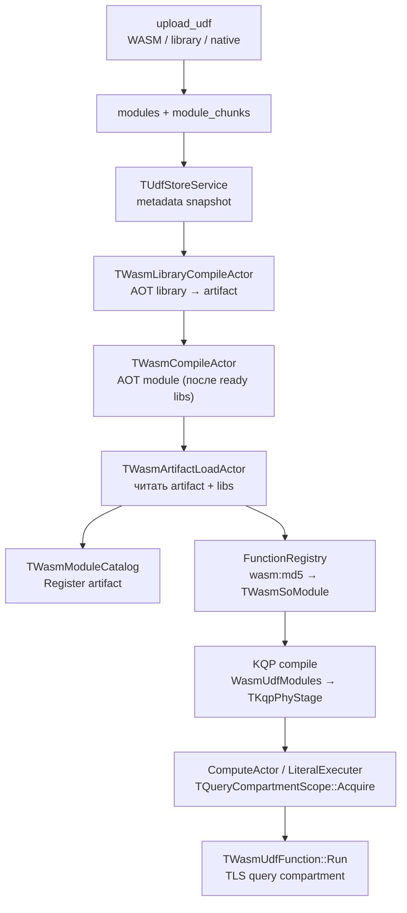

# WASM UDF Runtime — архитектура

## 1. Цель дизайна

WASM UDF живут в UDF Store и исполняются через WAVM:

1. **Исходники** (`.wasm` / `.wat`) и **манифест** хранятся в системных таблицах.
2. **AOT-компиляция** (WAVM object code) пишется в per-CPU artifact-таблицы.
3. **FunctionRegistry** видит модуль как обычный UDF (`ModuleName::Func`), без живого shared compartment.
4. На **каждый запрос / task** строится **отдельный compartment**: линкуются sdk + libraries + нужные UDF-модули; память и состояние не шарятся между запросами.

Ключевой сдвиг относительно «одного живого compartment на процесс»:  
**каталог артефактов — process-wide, compartment — per-query.**

---

## 2. Высокоуровневый поток



---

## 3. Хранение

Префикс: `.metadata/udf_store` (см. `metadata_subscription/storage_paths.*`).

| Таблица | Назначение |
|---|---|
| `modules` | Унифицированные записи: PK=`uid`, `md5`, `name`, `type`=`WASM`\|`LIBRARY`\|`NATIVE_UNSAFE`, manifest, version, size, chunk_count, compile_status/error, created_at, compile_started_at, compile_finished_at |
| `module_chunks` | Тело исходника (chunked blob), `owner_key`=`uid` |
| `artifact_<cpu_spec>` + chunks | AOT: wasm_data + object_code для module **или** library (без изменений) |

`cpu_spec` — нормализованный triple/cpu узла (`DetectLocalCpuSpec` / `WasmCpuSpecOverride`), чтобы object code был валиден на данной машине.

Artifact id остаётся `md5` для module и `name` для library. FunctionRegistry не переводится на uid.

Список текущих модулей (без доступа к `.metadata`):

```sql
SELECT Uid, Name, ModuleType, CompileStatus, Md5
FROM `.sys/udf_modules`
WHERE ModuleType = "WASM";
```

Колонки view: `Uid`, `Md5`, `Name`, `ModuleType`, `Version`, `Size`, `ChunkCount`, `CompileStatus`, `CompileError`, `CreatedAt`, `CompileStartedAt`, `CompileFinishedAt`, `Manifest`.

Upload helper: `ydb/tests/functional/udf_store/upload_udf`  
(`--action upload|delete`, `--kind udf|library`; для library нужен `--library-name`;
delete udf — `--md5` или `--udf-file`; delete чистит modules(+chunks) и best-effort AOT artifacts).

---

## 4. Манифест модуля

JSON, парсится `wasm/manifest.*` → `TWasmManifest`:

```json
{
  "module_name": "WithHelpers",
  "calling_convention": "unversioned_value",
  "module_extension": "wasm",
  "required_libraries": ["sdk", "helpers"],
  "functions": [
    {
      "name": "scale",
      "argument_types": [{"value": "int64", "tag": "concrete_type"}],
      "result_type": {"value": "int64", "tag": "concrete_type"}
    }
  ]
}
```

Важные поля:

- **`module_name`** — имя в YQL (`WithHelpers::scale`).
- **`module_extension`** — `wasm` | `wat` | `wast` → формат исходника / artifact.
- **`required_libraries`** — **упорядоченный** список имён библиотек (`modules.type=LIBRARY`).
  - **Первая** библиотека ставится как runtime via `AddSdk` / `CreateImageFromSdk` → модуль линкуется как **`"env"`**.
  - Остальные — `AddPrecompiledModule(..., name)` под своим именем (например `"helpers"`).
- **`functions`** — plain экспорты и типы ABI (`unversioned_value`).
- **`objects`** — stateful UDF с TypeConfig (ParseTskv-style). Разворачиваются в `functions` с `yql_binding=type_config_callable` (create/call/destroy exports). Реестр объектов — **static** `object_framework`, не отдельный wasm в `required_libraries`.

Пустой `required_libraries` → compartment из `CreateEmptyImage()` (standard host intrinsics: `AllocateBytes`, `ThrowException`).  
Если нужны `malloc`/`free` без пользовательского sdk — это отдельная тема (см. pitfalls).

### Objects / TypeConfigCallable

```json
{
  "module_name": "Prefix",
  "required_libraries": ["sdk"],
  "objects": [
    {
      "name": "Prefix",
      "create_export": "prefix_create",
      "destroy_export": "prefix_destroy",
      "methods": [{
        "name": "Apply",
        "export": "prefix_apply",
        "yql_binding": "type_config_callable",
        "argument_types": [{"value": "string", "tag": "concrete_type"}],
        "result_type": {"value": "string", "tag": "concrete_type"}
      }]
    }
  ]
}
```

YQL UX (opaque TypeConfig blob — host не парсит):

```sql
$fn = YQL::Udf(AsAtom("Prefix.Apply"), Void(), Void(), AsAtom("pre-"));
SELECT $fn("x");  -- "pre-x"
```

Host path (`TWasmConfiguredCallable`):

1. На первом `Run` (и после смены compartment generation): pin config blob через `compartment->AllocateBytes` + `memcpy`, вызвать `create_export(config)` → **ui64 handle**.
2. Каждый `Run`: `call_export(handle, args…)`.
3. Handle валиден только в текущем query compartment; при новом Acquire — recreate.

Статическая библиотека: `wasm/object_framework/` (`ObjectFrameworkCreate/Get/Destroy`). Модуль линкует через `PEERDIR`, не upload’ит framework.wasm.

Имена методов становятся YQL-именами функций (`Prefix::Apply`) и должны быть уникальны в манифесте.

При `create_export` хост также синтезирует **`New` → ui64`** (plain), если имя свободно. Methods с `yql_binding: "plain"` вызывают `export` напрямую (например `Snapshot(ctx) → string`). Optional `"export"` на `functions[]` — wasm-имя ≠ YQL `name`.

Shared context: один модуль линкует `object_framework`, передаёт `uint64` handle между `CountRow` / `CountPositive` и `Snapshot` (см. `examples/ctx/`, [adr-shared-wasm-context.md](./adr-shared-wasm-context.md)).

---

## 5. AOT-компиляция

### Библиотека — `TWasmLibraryCompileActor`

1. Читает строку `modules` (`type=LIBRARY`) + `module_chunks` по `uid`.
2. Ставит `compile_status=compiling` и `compile_started_at`.
3. `CompileModuleObjectCode(body, format)` (`wasm/compile.cpp`, WAVM `compileModule` → object code).
4. Пишет artifact (`kind=library`, id = library name): wasm_data + object_code chunks.
5. `compile_status = ready|failed` + `compile_finished_at` в `modules`.

### Модуль — `TWasmCompileActor`

1. Не стартует, пока `AreLibraryDependenciesReady(manifest)` (все `required_libraries` в snapshot со статусом `ready`).
2. Читает `modules` по md5 + chunks по `uid`, ставит `compiling` / `compile_started_at`.
3. Проверяет, что artifact’ы библиотек существуют.
4. Валидирует экспорты (`CollectWasmExports` vs plain `functions[].name` и create/call/destroy для `objects`).
5. Компилирует user module → artifact (`kind=module`, id = md5).
6. Обновляет `modules.compile_status` + `compile_finished_at`.

При смене/удалении библиотеки сервис может выгрузить зависящие WASM UDF и перезапустить compile (`UnloadWasmUdfsDependingOnLibrary`, `RetryPendingWasmCompilesForLibrary`).

---

## 6. Загрузка в процесс — `TWasmArtifactLoadActor`

После `compile_status=ready`:

1. Читает module artifact (wasm_data + object_code).
2. По порядку `required_libraries` читает library artifacts → `TVector<TNamedModuleBytecode>`.
3. `LoadWasmFromManifest` / `BuildModuleStateFromManifest`:
   - кладёт `TWasmModuleArtifact` в **`TWasmModuleCatalog`** (md5 + module_name → bytecode + libraries);
   - строит `TWasmSoModule` / `TWasmUdfFunction` и регистрирует в FunctionRegistry по пути `wasm:<md5>` с именем `module_name`.

На этом этапе **живой compartment для исполнения не создаётся** — только метаданные и object code в каталоге.

---

## 7. Module catalog vs per-query compartment

### `TWasmModuleCatalog` (process-wide)

- Хранит immutable-артефакты: манифест, module bytecode, список library bytecodes.
- Индексы: by md5, by module name.
- Потокобезопасный mutex.

### `TWasmCompartmentManager::Acquire(moduleNames)`

На каждый запрос (точнее — на scope в CA / literal executer):

1. `EnsureUdfHostIntrinsicsRegistered()` — host ABI в WAVM standard intrinsics.
2. `Catalog.ResolveModules(moduleNames)`.
3. Собирает уникальные libraries в порядке `RequiredLibraries` (первая — sdk/env).
4. `CreateRegistryCompartment(libraries)`:
   - `libraries.empty()` → `CreateEmptyImage()`;
   - иначе → `CreateImageFromSdk(first)` + `AddPrecompiledModule` для остальных.
5. Для каждого артефакта: `AddPrecompiledModule(moduleBytecode, moduleName)`.
6. Резолвит экспорты в map `"ModuleName::Export" → void*` (`MakeExportKey`) — для plain это YQL-имя, для objects — create/call/destroy.
7. Выставляет `Generation` (monotonic) на handle — TypeConfig callable пересоздаёт объекты при смене generation.

Результат — `TQueryCompartmentHandle` (compartment + Exports + Generation) под `std::shared_ptr`. Основной владелец — `TQueryCompartmentScope`, но резидентные строки держат свою ссылку через `TWasmAllocationRegistry` (см. «Время жизни резидентной строки»), поэтому compartment живёт до последнего значения в linear memory.

### TLS

Два уровня «текущего» указателя:

| TLS | Назначение |
|---|---|
| `TCurrentQueryCompartmentGuard` / `GetCurrentQueryCompartment()` | query handle с Exports (нужен `TWasmUdfFunction::Run`) |
| `TCurrentCompartmentGuard` / `GetCurrentCompartment()` (NYdb::NWasm) | WAVM compartment для PtrFromVM / host ThrowException |

`TQueryCompartmentScope::MakeTlsGuard()` ставит query TLS; внутри `Run` дополнительно ставится NYdb compartment guard.

---

## 8. Связка с KQP

1. **Compile / predictor** (`kqp_predictor`): обходит план, на `TCoUdf` ставит `HasUdf` и собирает имена модулей.
2. **Резолвер string-колонок** (`kqp_wasm_string_columns`) для каждого стейджа отдельно ведёт аргументы `Apply(Udf, …)` назад к физическим колонкам чтения этого же стейджа (`KqpRowsSourceSettings::Columns` у источника, `KqpWideRead*::Columns` у чтения внутри программы). Прослеживаются только шаги, сохраняющие сам буфер: `Member` физического row, аргументы `ExpandMap` / `WideMap` по индексу, AutoMap-развёртка (`Map` / `FlatMap` / `IfPresent`), `Just` / `Unwrap` / `Coalesce`, item-аргументы свёрток (`Condense1` / `Condense` / `Squeeze1` / `Squeeze` / `Fold1` / `Fold` / `CombineCore`); всё остальное — fail-closed. Свёртки обязательны для агрегатов: `SUM(Udf(column))` без `GROUP BY` компилируется в `Condense1` над строками источника, и UDF вызывается внутри init/update-хендлеров, а не под `Map` / `ExpandMap`.
3. Колонки попадают в `WasmUdfStringColumns` **только если стейдж содержит и чтение, и UDF**: буфер в линейной памяти WASM не переживает канал между стейджами, поэтому cross-stage пометки бессмысленны.
4. Модули пишутся в **KQP** `TKqpPhyStage.WasmUdfModules`; string columns — в `TKqpPhyStage.WasmUdfStringColumns`. При сериализации task оба списка кладутся в `TaskParams` (`_WasmUdfModules` / `_WasmUdfStringColumns`); string columns дополнительно копируются в scan/source settings для PreferWasm на чтении.
5. При сериализации task (`SerializeTaskToProto`) модули и string columns кладутся в `TaskParams["_WasmUdfModules"]` / `TaskParams["_WasmUdfStringColumns"]` (newline-separated); columns также копируются в scan/source settings.
6. **Compute actor** / **literal executer**:
   - CA читает модули и string columns из `TaskParams`; literal — напрямую `stage.GetWasmUdfModules()`;
   - `TQueryCompartmentScope(modules)` → `FilterLoadedWasmUdfModules` (только каталог) → `Acquire`;
   - на init scan: `ApplyWasmUdfStringColumns` → `PreferWasm` только для имён из TaskParams / source settings;
   - на обработке событий / DoExecute: `MakeTlsGuard()` → TLS guard;
   - при ошибке Acquire — `ErrorFromIssue` / failure state **до** `SetTaskRunner`.
7. Материализация scan: marked string → `MakePreferWasm` (1-copy cell→WASM); остальные large strings → host `MakeString`. Если колонка всё же уйдёт в WASM UDF при false negative — `FillAbiStringArg` сделает `CopyIntoCompartment`.
8. Исполнение UDF → `TWasmUdfFunction::Run` / `TWasmConfiguredCallable::Run` читает TLS query compartment.

Ошибка Acquire до появления task stats раньше маскировалась `AFL_ENSURE(stats.GetTasks().size() == 1)` в `kqp_executer_stats.cpp`; пустые Tasks при early failure теперь пропускаются, чтобы клиент видел исходный issue.

**Переключатель:** `TableServiceConfig.EnableWasmUdfResidentStringColumns` (default true, инвалидирует compile cache) — кластерный дефолт; на сессию переопределяется `PRAGMA ydb.EnableWasmUdfResidentStringColumns = "false"`. Выключение оставляет host-строку и `CopyIntoCompartment` на каждый вызов — это baseline для замеров и путь отката.

**Резидентные loop-invariant аргументы.** Резолвер string-колонок помечает только физические колонки читаемого стейджа. Аргумент, который не зависит от строки (скалярный подзапрос-словарь `$dict`, параметр, литерал), колонкой не является: он приезжает как параметр `%kqp%tx_result_binding_*`, стабилен на всё время task, но по умолчанию остаётся host-строкой и копируется в linear memory на каждый вызов UDF. `PRAGMA ydb.EnableWasmUdfResidentConstArgs = "true"` (`TableServiceConfig.EnableWasmUdfResidentConstArgs`, default **false**, инвалидирует compile cache) включает в peephole правило `KqpRewriteWasmResidentConstArgs`: у каждого `Apply(Udf, …)` string-аргумент, в поддереве которого нет ни одного `Argument` (то есть инвариантный внутри стейджа), оборачивается в callable `KqpWasmResidentString`. Его computation node (`kqp_wasm_resident_string.cpp`, регистрируется в `kqp_compute_actor` и `kqp_literal_executer`) один раз вызывает `MakePreferWasm`, кеширует результат в `ctx.MutableValues` и отдаёт его всем построчным вызовам — дальше `FillAbiStringArg` находит байты через `TryGetResidentOffset` и копий больше не делает. Opt-in, потому что на этапе компиляции wasm-UDF не отличить от нативной, а крупный блоб, прочитанный лишь частично, займёт linear memory впустую.

**Наблюдаемость:** `TPreferWasmStats` (`wasm/prefer_wasm_stats.h`) считает помеченные колонки, материализации в WASM, `CopyIntoCompartment` / reuse resident и fallback без compartment процесс-wide. `FallbackNoCompartment > 0` означает, что колонки помечены для стейджа без query compartment, то есть чтение и UDF всё-таки разъехались по разным task — планирование сломано.

Процесс-wide счётчики не отвечают на вопрос «сработала ли технология в этом запросе», поэтому те же события считаются ещё и на query compartment (`TQueryCompartmentHandle::PreferWasm`), а compute actor при сносе печатает их одной строкой в `KQP_COMPUTE` на уровне INFO:

```
:KQP_COMPUTE INFO: Wasm resident string columns columns=txt copiedIntoCompartment=0 \
    materializedInWasm=1000 residentReused=16000 residentConstArgs=0 task=1 txId=...
```

`columns` — что пришло в `WasmUdfStringColumns` для этого task, `materializedInWasm` — сколько значений колонки легло в linear memory, `residentReused` — сколько аргументов UDF взяли готовые байты, `copiedIntoCompartment` — сколько пришлось копировать на вызов, `residentConstArgs` — сколько инвариантных аргументов запиннила прагма `EnableWasmUdfResidentConstArgs` (по одному на `KqpWasmResidentString` в task). Baseline (`PRAGMA … = "false"`) даёт `columns=` пустым, `materializedInWasm=0` и все аргументы в `copiedIntoCompartment`. Для запроса-словаря с `EnableWasmUdfResidentConstArgs` ожидается `columns=` пустым, но `residentConstArgs=1`, `materializedInWasm=1` и `residentReused` = число строк при нулевом `copiedIntoCompartment`. Включается без рестарта: `curl "http://<node>:<mon-port>/actors/logger?c=535&p=6"`. Построчная трассировка (`[WasmString] Register` / `TryFree` в stderr) остаётся за `YDB_WASM_STRING_DEBUG=1` и годится только для запросов на единицы строк.

**Что реально экономится.** Замеры (`wasm/benchmark`, циклы на строку-колонку):

| Операция | Стоимость |
|---|---|
| Гостевой вызов `malloc` + `free` через экспорты wasm | ~233 цикла на пару |
| Поиск экспорта по имени | ~70 циклов |
| Host-строка (`MakeString`, 4 KB) | ~170 циклов |
| Копия 4 KB в linear memory | ~326 циклов |
| `MakePreferWasm` (4 KB: гостевой malloc + копия + регистрация) | ~950 циклов |
| Переиспользование резидентных байт в аргументе | ~38 циклов |

Полная стоимость значения (материализация плюс вызовы UDF), host против resident:

| Размер / вызовов | Host | Resident |
|---|---|---|
| 4 KB × 1 | 874 | 1004 |
| 16 KB × 1 | 1158 | 1218 |
| 32 KB × 1 | 3842 | 2497 |
| 64 KB × 1 | 7196 | 3989 |
| 256 KB × 1 | 25.3K | 13.5K |
| 4 KB × 2 | 1193 | 1121 |
| 64 KB × 4 | 17.8K | 4282 |

При одном вызове UDF на значение точка безубыточности лежит между 16 и 32 KB: ниже неё лишняя работа `MakePreferWasm` (регистрация в `TWasmAllocationRegistry` под локом) дороже сэкономленной копии, выше — resident выигрывает в 1.8–1.9 раза. При двух вызовах resident впереди уже на 4 KB, при четырёх на 64 KB — в 4 раза.

**Цена host→guest вызова.** Изначально пара `malloc`/`free` стоила 126K циклов, и это перекрывало любую экономию на копиях. Причина не в WAVM: страховка от переполнения стека (`CheckStackDepth` → `CheckFreeStackSpace`) запрашивала границы стека на входе в каждую гостевую функцию, а `TCurrentThreadLimits` вызывает `pthread_getattr_np`, который на главном потоке парсит `/proc/self/maps` (strace показывал ровно два `openat` на итерацию). Границы фиксированы на всё время жизни потока, поэтому теперь они кэшируются в `thread_local` (`engine/compartment.cpp`), и пара `malloc`/`free` стоит 233 цикла вместо 126K. Сам запрос границ: 49K циклов на главном потоке против 393 на pthread (`Part_StackBoundsQuery_*`) — то есть на actor-потоках сервера, где реально исполняются UDF, экономия составляет ~390 циклов на гостевой вызов (вызов подешевел примерно в 4 раза), а не 19 мкс.

**Что видно на живом кластере.** Все замеры до правки свёрток сравнивали baseline с baseline: и `bench_prefer_wasm.sh`, и demo-запросы — это `SELECT SUM(Udf(column)) …`, то есть стейдж со `Condense1`, где колонка не помечалась ни при `true`, ни при `false` (`materializedInWasm=0` в обоих режимах). Отсюда и «разница в пределах шума» со знаком, гуляющим между повторами. Мерять A/B без строки `Wasm resident string columns` в логе бессмысленно.

Первый честный замер — `text_1mb probes` (1000 × 1 MiB, 16 **разных** `Text::byte_at` на строку, `ydb/udfs/wasm/text/demo`): resident даёт 1000 материализаций и 16000 reuse против 16000 копий по 1 MiB у host, и это ~2× по wall и ~9× по серверному CPU. Повторять один и тот же вызов для профиля «много вызовов на значение» нельзя — YQL схлопывает идентичные `Apply(Udf, …)` в один; нужны разные экспорты.

Как перемерить:

```bash
./ya make -r ydb/services/udf_store/wasm/benchmark && ./ydb/services/udf_store/wasm/benchmark/benchmark
./ya make -tA ydb/services/udf_store/ut -F '*PreferWasmString*'   # инвариант «1 копия вместо 2» на счётчиках
./ya make -tA ydb/core/kqp/query_compiler/ut                      # формы, которые резолвер обязан проследить
# A/B на живом кластере через PRAGMA; режимы чередуются, чтобы прогрев не смещал результат.
# Сначала убедиться по логу, что колонка вообще помечена (см. «Наблюдаемость»).
TABLES=text_1mb SHAPES=probes WARMUP=1 RUNS=5 ydb/udfs/wasm/text/demo/run_demo.sh
```

**Время жизни резидентной строки:** `Make` отдаёт pod с нулевым refcount (конвенция MiniKQL `MakeString`), поэтому владелец доводит счётчик до нуля на UnRef и буфер освобождается сразу после строки, а не копится в linear memory до конца запроса.

Опасность в том, что у резидентной строки в linear memory лежит и сам refcount-заголовок: если compartment уничтожить раньше значения, `TStringValue::TData::UnRef` читает `Refs_` из размапленной памяти и нода падает по SIGSEGV. Так и падал `COUNT(DISTINCT ParseBlob::blob_head(blob))` при `PreferWasm = true`: `TKqpComputeActor::Terminate` звал `DoTerminateImpl()` (снос task runner и графа, где `DISTINCT`-состояние держит значения) **после** `PassAway()`, то есть уже после деструктора актора вместе с его `TQueryCompartmentScope`. Исправление двойное:

- `dq_compute_actor_impl.h`: `DoTerminateImpl()` вызывается до `PassAway()` — граф сносится, пока актор и его scope живы;
- shared-владение: `TWasmAllocationRegistry::Register` принимает keep-alive `shared_ptr` на handle и держит его, пока у generation есть живые аллокации. `~TQueryCompartmentScope` вызывает `ReleaseOwner(Generation)`: если значений уже нет — compartment уничтожается сразу, если есть — generation помечается `OwnerReleased`, `FreeBytes` для оставшихся значений пропускается (возвращать байты гостевому аллокатору перед сносом памяти незачем), а последний `TryFree` роняет keep-alive и compartment. Keep-alive всегда отпускается **вне** локов реестра: деструктор handle сам заходит в `ForgetGeneration`, и под локом это давало дедлок.

Итог: любое значение может пережить свой scope, и порядок сноса больше не важен для корректности. Регрессии закрыты тестами `TPreferWasmStringTest::ResidentValueOutlivesQueryScope` и `AllocationRegistryOwnerOutlivesLiveAllocations`.

**Второй путь освобождения — LLVM codegen.** `TStringValue::TData::UnRef` спрашивает `UdfTryFreeExternalString` (наша сильная реализация ходит в реестр), но JIT-код MiniKQL этот метод не вызывает: `UnRefUnboxed` инкрементит счётчик инлайном и на нуле зовёт `DeleteString` (`mkql_computation_node_codegen.cpp`), который отдавал байты прямо в `UdfFreeWithSize`. То есть резидентная строка, последняя ссылка на которую умирала внутри скомпилированного графа (а это обычный случай: `TFromFlowWrapper::Fetch_`), уходила аллокатору MiniKQL, который эту память не выделял, — `VERIFY failed: Double free at: 0x...` и падение ноды. Теперь `DeleteString` повторяет порядок `UnRef`: сначала хук, потом `UdfFreeWithSize`. Тест `TPreferWasmStringTest::CodegenDeleteStringReachesRegistry` зовёт `DeleteString` напрямую и без исправления воспроизводит тот же abort.

Практический вывод для новых типов «внешней» памяти под значения MiniKQL: путей освобождения два (интерпретируемый `UnRef` и `DeleteString` из codegen), и хук нужен в обоих.

**Ограничения PreferWasm (backlog).** Корректность всегда сохраняется: false negative → host-строка + `CopyIntoCompartment` на вызов. Ниже — что ещё **не** даёт reuse байт в linear memory и зачем это чинить. Дублируется как открытый список в [pitfalls-and-open-issues.md](./pitfalls-and-open-issues.md) §G.

| # | Область | Ограничение | Симптом / проверка | Направление фикса |
|---|---|---|---|---|
| 1 | Колонки / стейдж | Буфер в linear memory **не переживает канал** между стейджами. Пометка только если в одном стейдже и чтение, и UDF. | UDF после shuffle/join в другом stage: `columns=` пустой, всё в `copiedIntoCompartment` | Либо ко-локация read+UDF, либо сериализация resident через канал (дорого / сомнительно) |
| 2 | Колонки / AST | Резолвер **fail-closed**: только известные формы (`Member`, `ExpandMap`/`WideMap`, AutoMap, `Just`/`Unwrap`/`Coalesce`, item-аргументы `Condense*`/`Fold*`/`CombineCore`). Join, computed, результат другого UDF, неизвестные callable — нет. | `columns=` пустой при живом `Apply(Udf, col)` | Расширять `kqp_wasm_string_columns` по формам + UT |
| 3 | Колонки / `GROUP BY` | `DqPhyHashCombine` над wide-потоком: item-аргументы хендлеров сдвинуты на число ключей, индексного маппинга нет. | Агрегат с `GROUP BY` + UDF(col): host + copy | Маппинг wide-индексов в `CollectWasmUdfStringColumns` |
| 4 | Колонки / не-колонки | Литералы, параметры, скалярный `$dict` (`%kqp%tx_result_binding_*`) **не** физические колонки — резолвер их не помечает. | Словарь копируется на каждую строку без прагмы | `EnableWasmUdfResidentConstArgs` (см. ниже) или общий pin |
| 5 | ConstArgs | Opt-in, default **false**. На compile-time wasm UDF не отличить от native → риск лишней материализации в WASM для native. | Без прагмы: `residentConstArgs=0`, копии на вызов | Каталог модулей на compile / предиктор; затем default true |
| 6 | ConstArgs | Только **прямые** string-аргументы `Apply(Udf, …)` без `Argument` в поддереве. Не все строки запроса и не per-row args. | Обёртка вокруг UDF / косвенный вызов — без pin | Расширить peephole на `Apply` через переменную / `Bind` |
| 7 | ConstArgs | «Const» = loop-invariant **внутри task**, не immutable cell. Snapshot на материализации; concurrent UPDATE не обновляет mid-query. | Ожидаемо для словаря на время запроса | Документировать; при необходимости — explicit refresh API |
| 8 | ConstArgs / память | Крупный блоб, прочитанный UDF лишь частично, всё равно занимает linear memory на весь task. | Рост RSS / arena при большом `$dict` | Lazy / size threshold / pin только hot ranges |
| 9 | Runtime / short | `MakePreferWasm` для строк ≤ `InternalBufferSize` (embedded pod) **не** кладёт в linear memory — reuse невозможен. | Короткие ключи (`addr` 4 B): всегда copy на вызов | Обычно не чинить (экономия копии < overhead); порог осознанный |
| 10 | Runtime / compartment | Нет query compartment → host fallback (`FallbackNoCompartment`). | `FallbackNoCompartment > 0` | Чинить планирование (read и UDF в одном task) |
| 11 | Native UDF | PreferWasm / ConstArgs **не применимы**: нет guest linear memory. | Native baseline всегда host strings | N/A |
| 12 | Returns | Строковый **результат** UDF копируется guest→host; resident return path нет. | Многократный reuse результата между вызовами не выигрывает | Resident return + registry (если появится сценарий) |
| 13 | False positive | Резолвер не знает wasm vs native → в смешанном стейдже колонка для native тоже может быть PreferWasm (лишняя запись в WASM, не ошибка). | Лишние `materializedInWasm` при native | То же, что #5: знание каталога на compile |
| 14 | Вне скоупа | Blocks path, lazy holder — не покрыты. | Columnar / lazy scan | Отдельный дизайн |

Практический минимум для выигрыша сегодня: один стейдж read+WASM UDF, строка > ~16–32 KB (или много вызовов на значение), без `GROUP BY` (или UDF до combine), для словаря/параметра — `PRAGMA ydb.EnableWasmUdfResidentConstArgs = "true"`. Проверка — строка `Wasm resident string columns` в `KQP_COMPUTE`.

## 9. Host ABI и calling convention

Файлы: `wasm/host.*`, `wasm/abi/udf_cpp_abi.h`.

Зарегистрированы на **standard** intrinsic module (`getIntrinsicModule_standard()`):

- `AllocateBytes(context, size)` — аллокация через `TWasmUdfInvocationContext::WebAssemblyPool` (не через wasm `malloc`, когда вызывается host intrinsic).
- `ThrowException(const char*)` — `yexception` с текстом из wasm memory (`PtrFromVM` + `GetCurrentCompartment()`) и WAVM call stack (`captureCallStack` / `describeCallStack`).

`compartment->AllocateBytes` (engine) идёт через **экспорт `malloc` у RuntimeLibraryInstance_** (sdk / AddSdk). Поэтому:

- с пользовательским `sdk` в `required_libraries[0]` нужны рабочие `malloc`/`free` в этом sdk;
- stub sdk для тестов обязан экспортировать bump-`malloc` (см. `data/wasm/sdk_stub.wat`).

Calling convention `unversioned_value`: указатели на `TUnversionedValue` в wasm memory; типы int64/uint64/double/bool/string/null.

Ошибки из wasm: `ThrowException` → C++ exception → `WasmError` → `UdfTerminate("name(); ex: …")` (+ call stack).

Unload WASM: при delete/replace вызывается `NKqp::IDynamicFunctionRegistry::RemoveModule(moduleName)` (через cast от `IMutableFunctionRegistry`); иначе reupload того же `module_name` падает с `UDF module duplication`, а в registry остаётся старый набор функций.
---

## 10. Линковка модулей (WAVM)

`ydb/library/wasm/engine/compartment.cpp`:

- `CreateEmptyImage` — standard intrinsics как `"env"` (+ host после `EnsureUdfHostIntrinsicsRegistered`).
- `CreateImageFromSdk` — Empty + `AddSdk` (кэш `TSdkImageCache`); sdk instance = RuntimeLibraryInstance.
- `AddPrecompiledModule(bytecode, name)`:
  - требует **ObjectCode**;
  - IR: Binary → `loadBinaryModule(Data)`, HumanReadable (wat) → `ParseWast(Data)`;
  - instantiate под именем `name` (`"env"` для sdk, `"helpers"` для библиотеки, `ModuleName` для UDF).
- Импорты UDF вида `(import "helpers" "helpers_scale" …)` резолвятся в предыдущие instance’ы.

Порядок в compartment при `required_libraries: ["sdk", "helpers"]`:

1. env = Empty intrinsics + sdk (AddSdk);
2. module `"helpers"`;
3. module `"WithHelpers"` (UDF).

---

## 11. Примеры конфигураций

| Сценарий | required_libraries | Комментарий |
|---|---|---|
| Минимальный WAT без libc | `[]` | Empty image + host; без wasm-malloc в RuntimeLibrary |
| throw (`Throw::fail`) | `["sdk"]` | host `ThrowException` + call stack |
| oob (`Oob::crash` / `bad_index` / `null_deref` / `bad_ref`) | `[]` | WAVM OOB / null+offset / poison-ref traps + call stack |
| md5 | `["sdk"]` | полный emscripten sdk как env |
| with_helpers | `["sdk", "helpers"]` | sdk + промежуточная библиотека + модуль |
| prefix (objects) | `["sdk"]` | TypeConfig + `object_framework` PEERDIR |

C++ examples (emscripten): `tests/functional/udf_store/examples/`.  
CI без emscripten: WAT в `tests/functional/udf_store/data/wasm/`.

---

## 12. Инварианты (не ломать без явной причины)

1. **Compartment на запрос**, не shared live compartment между запросами.
2. **Первая** `required_libraries` entry = runtime/`"env"` через `AddSdk`, не через `AddPrecompiledModule(..., "sdk")` с именем `"sdk"`.
3. Перед линковкой UDF в Acquire — `EnsureUdfHostIntrinsicsRegistered()`.
4. `TWasmUdfFunction::Run` требует активный query TLS (`GetCurrentQueryCompartment()`).
5. Object code обязателен для библиотек и модулей в runtime path.
6. Compile модуля ждёт `compile_status=ready` у всех библиотек из манифеста.
7. Object registry — static link в модуль (`object_framework`), не отдельная entry в `required_libraries`.
8. Host хранит только **ui64** handle (+ generation); семантика TypeConfig blob — у модуля.
