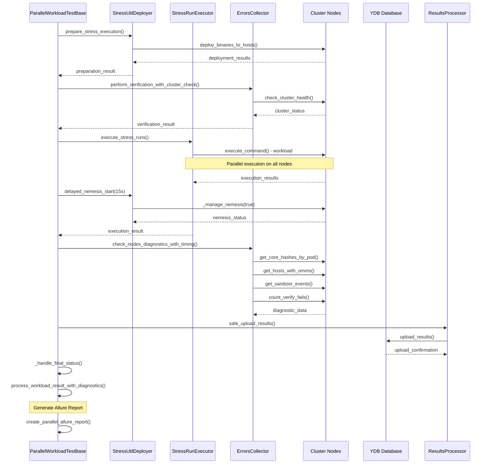

# YDB Stability Tests

## Adding Custom Workloads

### 1. Create Workload Configuration

Workloads are defined in the `all_workloads` dictionary. Each workload should specify:

```python
all_workloads = {
    'Ctas': {
                'args': ["--endpoint", "grpc://{node_host}:2135",
                        "--path", "workload_ctas_{node_host}_iter_{iteration_num}_{uuid}"],
                'local_path': 'ydb/tests/stress/ctas/ctas'
            }
}
```

### 2. Template Variables Available

The framework supports automatic variable substitution in command arguments:

- `{node_host}` - Target node hostname
- `{iteration_num}` - Current iteration number
- `{thread_id}` - Thread identifier (usually node host)
- `{run_id}` - Unique run ID (host_iteration_timestamp)
- `{timestamp}` - Run timestamp
- `{uuid}` - Short UUID (8 characters)

### 3. Parameterizing Workloads

Workloads can be parameterized using external parameters (ex. `table_type`):

```python
    for table_type in ['row', 'column']:
        _all_stress_utils[f'Kv_{table_type}'] = {
            'args': ["--endpoint", "grpc://{node_host}:2135",
                     "--store_type", table_type, "--kv_prefix", f"workload_kv_{table_type}_{{node_host}}_iter_{{iteration_num}}_{{uuid}}"],
            'local_path': 'ydb/tests/stress/kv/workload_kv'
        }
```

## Troubleshooting

### Common Issues

1. **Binary Deployment Failures**:
   - Check binary paths and permissions
   - Verify cluster node accessibility
   - Review deployment logs in Allure reports

2. **Nemesis Service Issues**:
   - Verify nemesis binary availability
   - Check service configuration files
   - Review journalctl logs for nemesis service

3. **Workload Execution Failures**:
   - Check command line arguments
   - Verify template variable substitution
   - Review stdout/stderr in Allure attachments

4. **Cluster Connectivity**:
   - Verify cluster health before test
   - Check network connectivity to nodes
   - Review cluster configuration files


## Test modules

### Core Components

#### 1. [`ParallelWorkloadTestBase`](ydb/tests/library/stability/workload_executor_parallel.py:15)
Base class for all parallel workload tests providing common functionality:

- **Automatic binary deployment** to cluster nodes
- **Parallel workload execution** across multiple nodes
- **Integrated diagnostics** and error collection
- **Allure reporting** integration
- **Nemesis service management** for fault injection

#### 2. [`StressUtilDeployer`](ydb/tests/library/stability/deploy.py:16)
Handles deployment and management of stress utilities:

- **Binary deployment** to cluster nodes
- **Nemesis service** startup and management
- **Cluster configuration** management
- **Parallel deployment** to multiple nodes

#### 3. [`StressRunExecutor`](ydb/tests/library/stability/run_stress.py:24)
Executes stress tests in parallel:

- **Parallel workload execution** using ThreadPoolExecutor
- **Timeout handling** and error recovery
- **Real-time progress tracking**
- **Command substitution** with variables

#### 4. [`ErrorsCollector`](ydb/tests/library/stability/utils/collect_errors.py:19)
Collects and analyzes cluster errors:

- **Coredump detection** and analysis
- **OOM (Out of Memory) detection**
- **Sanitizer error collection**
- **VERIFY failure analysis**
- **Cluster health monitoring**

#### 5. Data Models
- [`RunConfigInfo`](ydb/tests/library/stability/utils/results_models.py:6) - Test configuration
- [`StressUtilTestResults`](ydb/tests/library/stability/utils/results_models.py:176) - Aggregated test results
- [`StressUtilResult`](ydb/tests/library/stability/utils/results_models.py:111) - Per-utility results
- [`StressUtilNodeResult`](ydb/tests/library/stability/utils/results_models.py:54) - Per-node results

## Class Interaction Sequence



## Test Event Reporting

### When `test_event_report` is Generated

The framework generates test event reports in these scenarios:

1. **Test Initialization** (`TestInit`):
   - At test start with workload names and nemesis status

2. **Cluster Health Checks** (`ClusterCheck`):
   - Pre-test cluster verification
   - Post-workload cluster status
   - Nemesis service status verification
   - Deployment failures
   - Cluster availability issues

3. **Automated Events**:
   - Binary deployment failures
   - Nemesis partial/full startup failures
   - Cluster check exceptions

### Event Structure

```json
{
  "kind": "ClusterCheck",
  "suite": "ParallelStressUtil",
  "test": "workload_name",
  "timestamp": 1701172800,
  "is_successful": true,
  "statistics": {
    "verification_phase": "pre_test_verification",
    "check_type": "cluster_availability",
    "issue_type": null,
    "issue_description": "Cluster check passed successfully",
    "nodes_count": 10,
    "is_critical": false,
    "nemesis_enabled": true
  }
}
```

## Configuration Parameters

### External Parameters

The framework supports these external parameters:

- `cluster_path` - Path to cluster configuration
- `yaml-config` - YAML configuration file path
- `ignore_stderr_content` - Ignore stderr content for success determination
- `cluster_log` - Log collection mode ('default', 'all')
- `duration` - Test duration override
- `nodes_percentage` - Percentage of nodes to use (1-100)

### Environment Variables

- `NEMESIS_BINARY` - Custom nemesis binary path
- `WAIT_CLUSTER_ALIVE_TIMEOUT` - Cluster health check timeout
- `CI_REVISION` / `CI_BRANCH` - CI version information